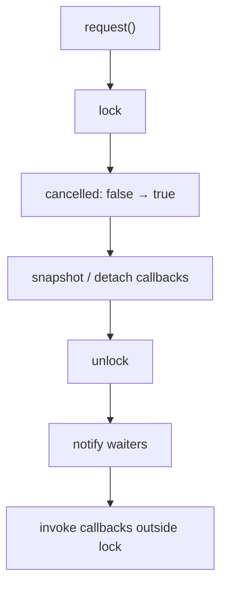

# Cancellation：并发、重入与生命周期

> 引入版本：v0.0.1；并发加固完成于 v0.0.2。  
> 当前实现：`include/pi/ai/cancellation.hpp`

## 1. 为什么单独定义 CancellationToken

pi-cpp 当前使用 C++17，不能直接依赖 C++20 的 `std::stop_token`。项目因此提供自己的取消抽象：

```text
CancellationToken
CombinedCancellation
```

它的目标是为 Provider、HTTP stream、后续 Agent runLoop / tool execution 提供统一的“请求取消”信号，但**不宣称与 `std::stop_token` API 或内存模型完全等价**。

长期约束是：取消是一种协作式信号，而不是强制终止线程。

## 2. CancellationToken 的状态模型

核心状态：

```text
cancelled_ : atomic<bool>
callbacks_ : ordered callback registry
mtx_       : protects callback registry / transition
cv_        : wakes waiters
```

状态只有一次单向转换：

```text
not requested
      │ request()
      ▼
requested
```

`request()` 必须幂等。第一次 request 完成 transition；后续 request 直接返回。

## 3. 最重要的规则：锁保护状态，不保护用户代码

错误实现通常是：

```text
lock
  cancelled = true
  invoke user callbacks   ← 危险
unlock
```

这会导致两个问题：

1. callback 如果再次调用 `request()`、`registerCallback()` 或其它需要同一 mutex 的 API，会自锁；
2. 用户 callback 的执行时间不可控，会把内部 mutex 变成任意长时间持有的全局串行点。

pi-cpp 的正确流程是：



对应原则：

> 内部锁只保护内部状态；绝不在内部锁下执行用户提供的 callback。

这个原则以后同样适用于 Agent hook、tool callback、telemetry sink 等扩展点。

## 4. callback 注册顺序

当前 callback id 单调递增，并使用按 id 排序的容器保存，因此 request 时 callback 按注册顺序 snapshot。

可观察语义：

```text
register A
register B
register C
request

执行顺序：A → B → C
```

不要把容器随意改成无序结构，否则会无意改变 callback ordering。

## 5. register-after-cancel

如果 token 已经 requested：

```cpp
registerCallback(cb)
```

不会把 callback 再放入 registry，而是：

```text
lock
  observe requested
unlock
invoke cb synchronously
return 0
```

这里仍然要求 callback **在锁外执行**。

`0` 表示没有形成可 unregister 的注册记录。

这保证了典型竞态：

```text
Thread A                Thread B
--------                --------
request()
                        registerCallback(cb)
```

无论线性化顺序是哪一种，callback 都不会被静默丢失。

## 6. request / unregister 的线性化语义

`unregisterCallback(id)` 与 `request()` 之间存在天然竞态。

当前语义：

- 如果 `unregisterCallback(id)` 在 request snapshot 前成功删除 callback，返回 `true`，callback 之后不会执行；
- 如果返回 `false`，callback 可能已经被 request snapshot，也可能已经执行；
- request 一旦完成 snapshot，callback 是否已经真正开始执行不再由 unregister 控制。

可以理解为：

```text
                request snapshot
                      │
──── unregister ──────┼──────────── time
      true            │ false / too late
```

不要试图通过“callback 是否已经调用”来定义 unregister 的成功条件，那会把 API 推向更复杂的 per-callback 状态机。

## 7. 为什么 callback 必须允许重入

合法 callback：

```text
callback
  ├─ token.request()
  └─ token.registerCallback(...)
```

因为用户代码可能由多个层次组合而来，要求 callback 永不触碰 cancellation API 不现实。

v0.0.2 的 focused tests 明确覆盖 reentry，因此后续重构必须保留：

- 不死锁；
- request 幂等；
- register-after-cancel 语义稳定。

## 8. wait_for 的角色

`wait_for(timeout)` 用于阻塞等待：

```text
requested → 立即 true
not requested → 等待 request 或 timeout
```

它基于 `condition_variable`，predicate 读取 atomic cancelled 状态，避免虚假唤醒造成错误结果。

注意：是否在某个具体 retry sleep 中使用 `wait_for()` 属于 Provider 的兼容语义，而不是 CancellationToken 自身的要求。例如 v0.0.2 OpenAI-compatible retry 为对齐 pi v0.80.0，并不会用可中断 wait 提前结束 SDK-style backoff sleep。

## 9. CombinedCancellation

CombinedCancellation 表达：

```text
source A ─┐
source B ─┼─→ combined token
source C ─┘
```

任意 source request 都会 request combined token。

### 9.1 不能捕获裸 this

危险写法：

```cpp
source->registerCallback([this] {
    combined_.request();
});
```

如果：

```text
Thread A: source.request()
Thread B: ~CombinedCancellation()
```

callback 可能在 owner 已析构后访问 `this`，形成 UAF。

### 9.2 shared/weak state

当前设计把真正需要 callback 访问的 combined token 放进独立 shared state：

```text
CombinedCancellation owner
        │ owns
        ▼
   shared State
        │
        └─ CancellationToken combined

source callback
        │ captures weak_ptr<State>
        ▼
lock weak_ptr
  ├─ success → combined.request()
  └─ expired → no-op
```

析构时先：

```text
state_.reset()
```

让正在或随后执行的 source callback 无法再取得 state，然后再尝试 unregister source registrations。

这把“owner 生命周期”和“callback 并发生命周期”解耦。

## 10. 为什么析构时 unregister 仍然必要

weak state 已经避免 UAF，但仍 unregister 的原因是：

- 避免 source token 长期保留无意义 callback；
- 降低 callback registry 垃圾；
- 明确解除组合关系。

不过析构正确性**不能依赖 unregister 一定成功**，因为 request 可能已经 snapshot callback。因此 weak state 才是生命周期安全的核心。

## 11. 当前不做什么

当前 CancellationToken 不提供：

- callback execution executor；
- cancellation reason payload；
- hierarchical cancellation tree；
- deadline token；
- lock-free callback registry；
- `std::stop_token` API 兼容层。

这些能力只有在实际 Agent / RPC 场景证明需要后再扩展。

## 12. 修改 CancellationToken 时必须保持的测试

至少保持以下 focused tests：

```text
request idempotence
callback registration order
register-after-cancel
callback reentry
request / unregister race
multiple concurrent request
CombinedCancellation any-source propagation
CombinedCancellation source-request / destructor race
```

如果修改 callback container、析构顺序或锁粒度，应优先增加 race/stress test，而不是只依赖普通单线程单测。

## 13. 设计结论

Cancellation 的长期设计原则可以压缩成三句话：

1. **状态在线性化点内修改，用户代码在线性化点外执行。**
2. **unregister 只保证 snapshot 前的移除，不承诺撤回已经 snapshot 的 callback。**
3. **并发 callback 不能依赖 owner 裸生命周期，组合关系用 shared/weak state 解耦。**
