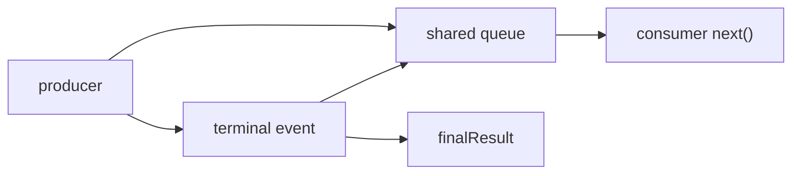

# EventStream：事件流与终止语义

> 引入版本：v0.0.2。  
> 当前实现：`include/pi/ai/event_stream.hpp`

## 1. EventStream 解决什么问题

Provider、Agent、Tool 都会产生“先有中间事件，最后才有最终结果”的异步过程。

典型 Provider 流：

```text
start
text_start
text_delta
text_delta
text_end
done
```

调用方既需要逐个消费事件，又需要在结束后取得最终 `AssistantMessage`。`EventStream<T, R>` 就是这两种需求之间的桥梁。

它不是网络协议，也不是 Provider；它只负责：

- producer 按顺序 push event；
- consumer 阻塞式 `next()`；
- terminal event 到来后结束；
- terminal event 提取最终 result；
- copied handle 共享同一条 stream 状态。

## 2. 核心状态

每个 EventStream handle 持有同一个 shared state：

```text
shared State
├─ mutex
├─ condition_variable
├─ deque<T> queue
├─ bool done
├─ optional<R> finalResult
├─ isComplete(event)
└─ extractResult(event)
```

因此：

```cpp
auto a = stream;
auto b = a;
```

`a` 和 `b` 不是两条独立 event stream，而是两个共享 handle。

## 3. Producer / Consumer 模型



`push()` 可以从 worker thread 调用，`next()` 可以在调用线程阻塞消费。

### 3.1 FIFO

事件进入 `std::deque`，消费者按 push 成功的顺序出队。

### 3.2 blocking next

`next()` 等待：

```text
queue not empty OR done
```

如果 queue 有事件，即使 stream 已经 terminal，也会先把队列中的事件消费完。

如果：

```text
queue empty AND done
```

返回 `std::nullopt`。

## 4. terminal event 本身必须可消费

这是与 pi v0.80.0 对齐的重要可观察语义。

错误设计：

```text
push(done)
  mark done
  不入队
```

会让 consumer 只能观察“流结束”，看不到 `done` / `error` event 本身。

pi-cpp 的语义是：

```text
push terminal event
      │
      ├─ extract final result
      ├─ mark done
      └─ terminal event 入 queue
```

因此：

```text
next() → done/error event
next() → nullopt
```

而不是直接 `nullopt`。

## 5. terminal 之后的 push

一旦 `done == true`：

```cpp
stream.push(...)
```

被忽略。

这样可以避免：

- HTTP worker 在 terminal error 后继续推送残余 chunk；
- detached producer 的迟到事件污染已经冻结的最终结果；
- terminal event 后又出现普通 delta。

这也是为什么 Provider / decoder 可以安全地多处尝试 fail/finish：真正第一个 terminal transition 获胜。

## 6. result() 的语义

`result()` 等待的是：

```text
finalResult.has_value()
```

不是单纯等待 `done == true`。

这一区别非常重要。

### 6.1 terminal event

如果 `isComplete(event)` 为 true：

```text
extractResult(event)
      ↓
finalResult
```

随后 `result()` 返回。

### 6.2 end(result)

producer 也可以显式：

```cpp
stream.end(result);
```

直接提供最终结果。

### 6.3 end() without result

```cpp
stream.end();
```

只表示“不会再有事件”，但**不会凭空产生 final result**。

因此：

```text
end()
next() → eventually nullopt
result() → 仍等待 finalResult
```

这个行为是有意保留的，不能把它改成“done 时 result() 抛异常”来图方便，否则会偏离固定基线 generic EventStream 语义。

## 7. AssistantMessageEventStream

`AssistantMessageEventStream` 是：

```cpp
EventStream<AssistantMessageEvent, AssistantMessage>
```

它把 terminal 定义为：

```text
EvDone
EvError
```

结果提取：

```text
EvDone  → done.message
EvError → error.error
```

因此 error 并不意味着 `result()` 抛异常；最终 `AssistantMessage` 本身携带：

```text
stopReason = Error / Aborted
errorMessage
```

调用方可以同时通过 terminal event 和 final message 判断失败原因。

## 8. copied handle 不等于 broadcaster

这是最容易误解的一点。

因为多个 handle 共享**同一个 queue**：

```text
consumer A ─┐
            ├─ shared queue
consumer B ─┘
```

如果 A 和 B 都调用 `next()`，它们会竞争消费事件；一个事件不会自动复制给两个 consumer。

所以 EventStream 当前语义更接近：

> shared single-consumption stream handle

而不是：

> pub/sub broadcaster

如果以后 TUI、RPC、Telemetry 需要每个 subscriber 都收到完整事件序列，应单独设计 broadcaster，不要通过复制 EventStream handle 偷偷改变语义。

## 9. 线程安全边界

State 的 queue、done、finalResult 由 mutex 保护。

`isComplete(event)` 与 `extractResult(event)` 在内部锁之外执行，避免扩展逻辑在 mutex 下运行。

这意味着 generic `EventStream<T, R>` 的自定义 predicate/extractor 应满足：

- 构造后视为 immutable；
- 如果多个 producer 并发 push，函数对象本身必须能安全并发调用。

当前 `AssistantMessageEventStream` 使用无状态 lambda，因此不存在额外共享状态问题。

## 10. 为什么不是 coroutine / lock-free queue

v0.0.2 有意选择：

```text
mutex + condition_variable + deque
```

原因是当前目标是：

- C++17；
- 先冻结与 pi 的 observable behavior；
- producer/consumer 并发正确性优先；
- API 简单、可测试；
- 不为尚未出现的吞吐瓶颈增加复杂度。

当前不做：

- C++20 coroutine async iterator；
- lock-free MPMC queue；
- fan-out broadcaster；
- backpressure protocol；
- bounded queue；
- executor affinity。

如果后续 profiling 证明 mutex/queue 是瓶颈，再替换内部实现，但 public observable semantics 应尽量保持。

## 11. EventStream 与 Provider 的边界

```text
Provider / decoder
      │ produces semantic events
      ▼
EventStream
      │ transport/order/wakeup only
      ▼
consumer
```

EventStream 不应该知道：

- HTTP；
- SSE；
- OpenAI；
- retry；
- tool-call JSON；
- model/provider 配置。

这些都属于 EventStream 上游。

## 12. 后续 Agent EventStream

v0.0.3 以后 Agent 层会有类似模式：

```text
Agent runLoop
    ↓
AgentEvent
    ↓
EventStream-like consumption
```

应复用这里已经验证过的几个原则：

- terminal event 本身可观察；
- terminal 之后拒绝迟到事件；
- result 与 done 分开建模；
- public stream 不泄漏内部 worker/thread 类型；
- broadcaster 与 single-consumer stream 不混为一谈。

## 13. 修改 EventStream 时必须保持的测试

至少覆盖：

```text
FIFO
blocking next wake-up
terminal event delivery
terminal then next == nullopt
push after terminal ignored
result extracted from done
result extracted from error
end(result)
end() without result does not synthesize result
copied handle shares state
producer/consumer cross-thread
```

## 14. 设计结论

EventStream 的长期语义可以概括为：

1. **事件与最终结果是两个相关但不同的通道。**
2. **terminal event 既终止 stream，也仍然是 consumer 必须能看到的事件。**
3. **handle 可以复制，但 queue 不广播；复制表示共享状态，不表示订阅。**
