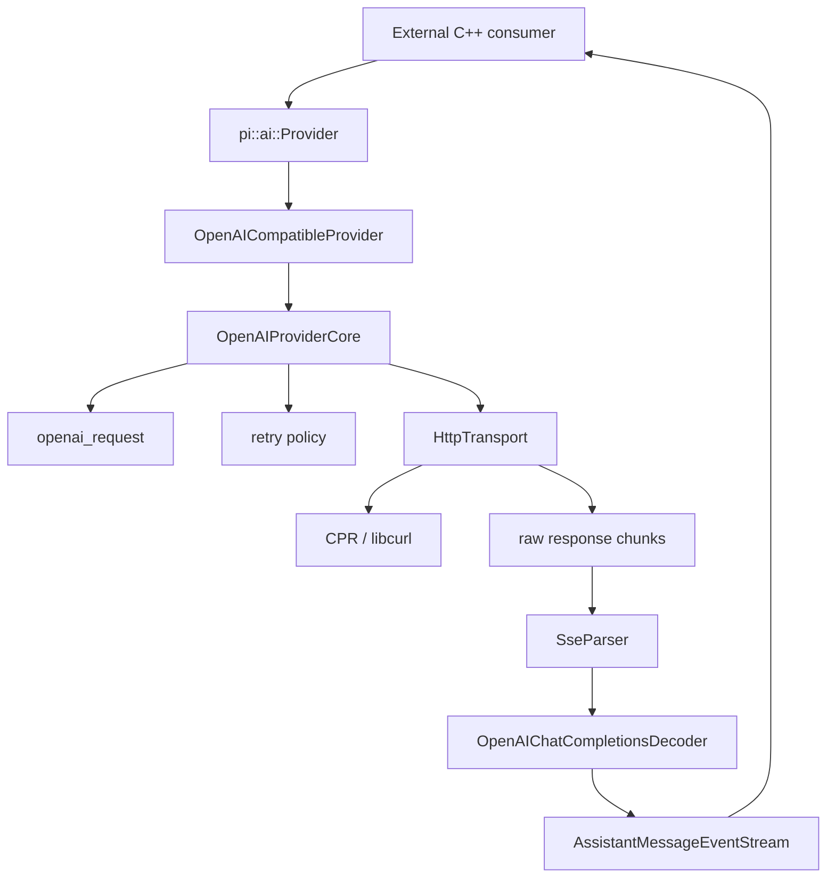

# Provider Runtime：Public API、Transport 与 Protocol Decoder 分层

> 引入版本：v0.0.2。  
> 主要代码：`include/pi/ai/provider.hpp`、`include/pi/ai/openai_compatible.hpp`、`src/ai/openai_provider.*`、`src/ai/openai_request.*`、`src/ai/openai_completions_decoder.*`、`src/ai/http.*`。

## 1. 这份文档解决什么问题

Provider runtime 的关键不是“怎么请求 OpenAI”，而是把不同变化速度的职责拆开：

```text
public capability
provider lifecycle
wire request mapping
HTTP transport
stream framing
provider protocol semantics
public event stream
```

如果这些职责混在一个类里，后续增加 Anthropic、OpenAI Responses、Gemini、代理服务或新的 HTTP 实现时，会同时牵动 public API、网络层和协议层。

pi-cpp v0.0.2 因此形成了稳定分层。

## 2. 总体结构



最重要的边界是：

```text
include/pi/ai/*          public SDK
-------------------------------
src/ai/*                 private runtime implementation
```

CPR、curl、socket、HTTP callback 等类型不能跨过这条边界。

## 3. Public Provider API

`Provider` 的职责很小：

```cpp
virtual AssistantMessageEventStream stream(
    const Model& model,
    const Context& context,
    const StreamOptions& options) = 0;
```

输入只包含 pi-cpp 自有模型：

```text
Model
Context
StreamOptions
```

输出只包含：

```text
AssistantMessageEventStream
```

### 3.1 为什么 public API 不暴露 HTTP

外部调用者关心的是：

```text
用哪个模型
有哪些上下文消息
有哪些 tools
怎么取消/超时
收到哪些 L1 events
```

而不应该被迫知道：

```text
cpr::Session
CURL*
HTTP response callback
socket handle
SSE parser state
retry internal state
```

这样未来可以替换 transport 而不破坏 SDK ABI/API 设计。

## 4. OpenAICompatibleProvider：Public Facade

public 类型：

```text
include/pi/ai/openai_compatible.hpp
OpenAICompatibleProvider
```

它使用 PImpl：

```text
OpenAICompatibleProvider
        │ shared_ptr<Impl>
        ▼
private implementation
```

PImpl 的价值不是“隐藏代码”这么简单，而是：

- public header 不 include CPR/curl；
- private runtime 类型可以演进；
- 外部 consumer 编译依赖更稳定；
- Windows private DLL/static linkage 问题不进入 public API；
- 后续 transport 或 core 重构不会扩大 SDK surface。

## 5. 为什么 public 叫 OpenAICompatibleProvider

这个名字表达的是**能力边界**：它面向 OpenAI-compatible endpoint。

命名参考 Tau `v0.4.1` 的 Provider facade。

它不表示内部只有一个 OpenAI wire 协议。以后完全可能出现：

```text
OpenAICompatibleProvider
├─ Chat Completions path
└─ Responses path
```

因此 public facade 不应该叫 `OpenAIChatCompletionsProvider`，否则未来扩展会把 API 名称锁死在单一协议上。

## 6. OpenAIProviderCore：Lifecycle Orchestration

private `OpenAIProviderCore` 负责把各个部件编排起来，而不是负责解析协议。

主要职责：

- 校验 auth / base URL；
- 合并 headers；
- 构造 endpoint URL；
- 调用 request builder；
- 发起 HTTP stream；
- 驱动 retry policy；
- 把 transport chunks 送入 decoder；
- 把 transport/runtime failure 映射成 terminal `EvError`；
- 管理 worker thread 所需对象生命周期。

它**不应该**负责：

- SSE framing grammar；
- partial JSON parsing；
- text/tool-call aggregation；
- finish_reason → StopReason；
- usage parsing。

这些属于 decoder 层。

## 7. Request Builder：Outbound Wire Mapping

`openai_request.*` 负责：

```text
pi::ai::Model / Context / StreamOptions
                 ↓
OpenAI Chat Completions JSON body
```

这层是纯数据转换，应该尽量做到 deterministic、无网络、副作用小。

典型内容：

- system prompt；
- user message；
- assistant history；
- tool result；
- tool definitions；
- image data URI；
- max_tokens / temperature；
- stream / stream_options；
- reasoning context replay。

把 request mapping 单独拆出来的好处是：

> wire mapping bug 与 HTTP/retry bug 可以分别测试和定位。

## 8. HttpTransport：Transport Boundary

private transport abstraction只关心：

```text
HttpRequest
    ↓
postStream()
    ↓
raw body chunks + HttpResponse
```

它不知道：

- OpenAI event；
- AssistantMessage；
- tool calls；
- finish_reason。

这使 deterministic test 可以注入 fake transport，验证 Provider lifecycle，而不真实联网。

### 8.1 CPR/libcurl 保持 private

当前实现使用 CPR 1.14.2 / libcurl，但只通过：

```text
PRIVATE cpr::cpr
```

链接到 `pi_ai`。

Windows 曾经通过 external consumer test 暴露过 `cpr.dll` runtime dependency 问题，因此依赖构建保持 static private implementation，并避免修改宿主工程全局 `BUILD_SHARED_LIBS` cache。

这条经验应长期保留：

> private SDK implementation dependency 不应该把其部署细节强制传递给 public consumer。

## 9. SSE Parser：Framing，而不是语义

HTTP callback 提供的是任意 transport chunk：

```text
chunk 1: "data: {\"cho"
chunk 2: "ices\": ...}\n\n"
```

所以 `SseParser` 只负责：

```text
arbitrary bytes/chunks
        ↓
complete SSE event
```

它不解析 OpenAI JSON。

这种拆分避免把三个不同边界混为一谈：

```text
HTTP chunk boundary
SSE event boundary
JSON / semantic object boundary
```

## 10. OpenAIChatCompletionsDecoder：Protocol Semantics

private 类型：

```text
src/ai/openai_completions_decoder.*
OpenAIChatCompletionsDecoder
```

名字有意对应 pi v0.80.0：

```text
packages/ai/src/api/openai-completions.ts
```

它负责：

```text
SSE event data
      ↓
ChatCompletionChunk JSON
      ↓
text / thinking / tool-call state
      ↓
AssistantMessageEvent
```

具体职责包括：

- response id/model；
- usage；
- finish_reason；
- text aggregation；
- thinking/reasoning aggregation；
- tool calls by stream index/id；
- partial arguments JSON；
- encrypted reasoning detail / thoughtSignature；
- terminal done/error。

### 10.1 为什么不叫 private `openai_compatible.*`

`compatible` 描述 Provider 的能力范围，而 decoder 实际只处理 Chat Completions streaming protocol。

如果 public/private 都叫：

```text
openai_compatible.hpp
```

容易混淆：

```text
Provider facade
vs
protocol decoder
```

因此 v0.0.2 closeout 时统一为：

```text
public  openai_compatible.hpp
private openai_completions_decoder.hpp/.cpp
```

## 11. EventStream 是最终 observable boundary

Decoder 不把内部状态直接暴露给 consumer，而是只推：

```text
AssistantMessageEventStream
```

这样外部只观察：

```text
start
text/thinking/toolcall start/delta/end
done/error
```

HTTP retry、callback 次数、curl 状态机等都不是 public observable API，除非它们最终改变事件序列、错误或时序兼容语义。

## 12. Error Boundary

Provider worker thread 中的异常不能逃逸到线程入口导致 `std::terminate`。

长期规则：

> request/runtime failure 应映射成 terminal `EvError`，而不是让 worker-thread exception 泄漏。

这包括：

- missing API key；
- invalid base URL；
- HTTP error；
- transport error；
- cancellation；
- malformed SSE JSON；
- missing finish_reason；
- provider error stop reason。

## 13. 生命周期设计

`stream()` 返回后 worker 可以继续执行，因此不能引用调用栈上的临时对象。

当前 core 在启动 worker 前复制：

```text
Model
Context
StreamOptions
RetryHooks
transport shared_ptr
decoder shared_ptr
```

这让：

```text
OpenAICompatibleProvider::stream(...)
return EventStream
```

之后 producer 仍有自己所需的生命周期。

后续如果把 detached thread 改为 executor/thread pool，也必须保持“worker 不悬挂引用调用栈对象”的原则。

## 14. Test Seams

Provider runtime 有两类测试 seam：

### 14.1 pure mapping tests

```text
openai_request
sse_parser
streaming_json
retry policy
```

无网络、确定性强。

### 14.2 injected runtime tests

`OpenAIProviderCore` 可以注入 fake `HttpTransport` / retry hooks，用于验证：

- headers/body/url；
- 401/429/503；
- retry count；
- no retry after stream start；
- cancellation；
- empty response；
- response-body transport failure。

### 14.3 public end-to-end test

Compatibility harness 通过真实本地 HTTP/SSE server 调用：

```text
public OpenAICompatibleProvider
```

防止 private unit tests 全绿但 public wiring 错误。

## 15. 新增 Provider / Protocol 时怎么放

推荐模式：

```text
include/pi/ai/<provider facade>.hpp      public capability
src/ai/<provider>_provider.*            lifecycle orchestration
src/ai/<protocol>_request.*             outbound wire
src/ai/<protocol>_decoder.*             inbound semantics
src/ai/http.*                           shared transport
src/ai/retry.*                          shared/private policy
```

例如未来 OpenAI Responses：

```text
OpenAICompatibleProvider
        ↓ selects protocol
openai_responses_request.*
openai_responses_decoder.*
```

不需要重新暴露另一套 HTTP API。

## 16. 当前不做什么

v0.0.2 不提供：

- public transport injection API；
- public CPR/curl handle；
- provider plugin registry；
- generic REST client；
- OpenAI Responses API；
- Anthropic/Gemini provider；
- coroutine-based networking；
- public retry strategy object。

这些能力需要实际版本需求驱动。

## 17. 设计结论

Provider runtime 的长期规则可以概括为：

1. **Public Provider 描述能力，不描述 HTTP 实现。**
2. **Transport 只传字节，Parser 只做 framing，Decoder 才解释 Provider 协议。**
3. **request mapping、retry、transport、decoder 必须可分别测试。**
4. **外部可观察语义最终统一收敛到 EventStream。**
5. **private dependency 的类型和部署要求不能泄漏到 SDK consumer。**
