# 用 C++ 重写 pi coding agent（1）：v0.0.1 骨架、核心类型与 SDK 边界

> 状态：**已完成**  
> 系列导航：上一篇（无，本篇是系列开篇）｜ 下一篇 **v0.0.2 Provider / SSE** ｜ [项目总览](../dev-plan.md) ｜ [最终验收记录](../closeout/v0.0.1.md) ｜ [pi 架构参考](../pi-architecture.md)

## 0. 本篇位置

pi-cpp 使用 **C++17** 重写 pi coding agent 的核心能力。行为与 wire 语义以 pi `v0.80.0` 为规范来源；Tau `v0.4.1` 只辅助理解模块划分、算法和工程实现，不作为行为规范来源。

`v0.0.1` 的任务不是做出一个能调用 LLM 的 Agent，而是把后面所有功能依赖的地基一次搭正确：

1. Linux / macOS / Windows 三平台构建与 CI 骨架。
2. `ai`、`agent`、`coding-agent` 三层 SDK 的源码与 public header 边界。
3. pi 兼容方向的消息 / 内容块 / 事件 wire 类型。
4. C++17 下需要的取消、线程和基础工具设施。
5. 手工 JSONL fixture 与确定性单元测试。

版本位置：

| 版本 | 主题 | 状态 |
|---|---|---|
| **v0.0.1** | **骨架 + 核心类型 + 三层 SDK 边界** | ✅ 已完成 |
| v0.0.2 | Provider + SSE + 真实差分基座 | 下一篇 |
| v0.0.3 | Agent 主循环 | 计划中 |
| v0.0.4 | coding-agent 工具四件套 | 计划中 |
| v0.1.0 | print MVP + Stable Session Wire | 计划中 |
| … | 完整路线见 [dev-plan](../dev-plan.md) | |

---

## 1. 为什么 v0.0.1 就要确定 SDK 边界

pi 的核心并不是一个 CLI，而是三个可以逐层复用的能力包：

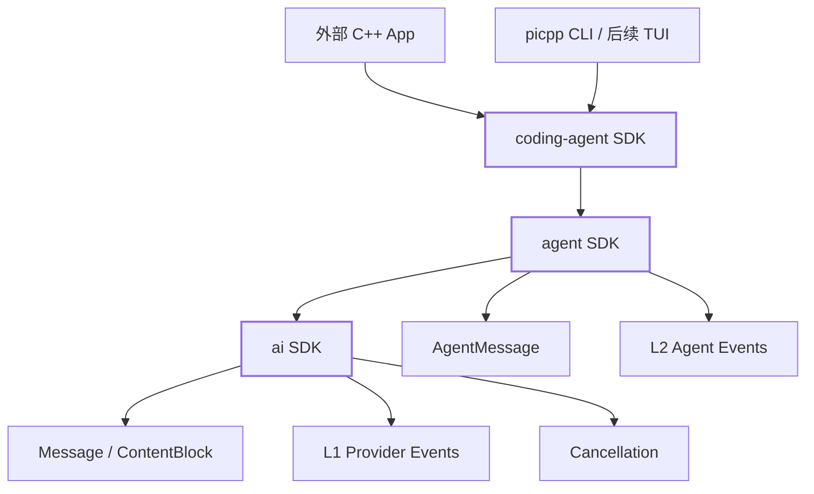

在 C++ 中，这种边界比 TypeScript 更需要尽早明确，因为它会直接决定：

- public header 放在哪里；
- CMake target 的依赖方向；
- 第三方类型是否泄漏到 API；
- 外部工程能否单独链接某一层；
- 后续 install/export/package config 是否容易实现；
- CLI/TUI 是否会反向污染核心业务层。

如果先用一个 `pi_types` 把所有代码堆在 `src/`，再等 Provider、Agent loop、tools 都写完以后拆层，会同时改动 include、target dependency、namespace、测试和调用方。`v0.0.1` 代码量最小，因此这里就是建立长期边界的最低成本窗口。

依赖只能向下，不能反向。最重要的含义不是“目录看起来分层”，而是：**任何只需要调用模型能力的程序，都不应该被迫链接 Agent；任何只需要通用 Agent loop 的程序，也不应该被迫依赖 coding-domain 工具。**

---

## 2. v0.0.1 目标与非目标

### 2.1 目标

1. 三平台 configure → build → ctest 基础链路。
2. `picpp --version` 输出 `picpp v0.0.1`。
3. 建立三个 CMake SDK target：`pi::ai`、`pi::agent`、`pi::coding-agent`。
4. public API 进入 `include/pi/...`，不把 `src/` 暴露成 SDK PUBLIC include path。
5. `ai` 层提供 LLM message/content 基础类型、StopReason / Usage / Cost、L1 Provider event、CancellationToken 基础抽象。
6. `agent` 层提供 AgentMessage 和 L2 AgentEvent。
7. `coding-agent` 建立 target、namespace 和 public header 目录骨架，为 `v0.0.4` 的 tools/CodingAgent 预留稳定位置。
8. 4 种 ContentBlock + 7 种 AgentMessage 角色的 JSON round-trip。
9. L1 12 种事件 + L2 10 种事件 round-trip。
10. 三个手工 JSONL fixture 作为内部序列化回归样本。
11. `ai` / `agent` / `coding-agent` 三个独立 public SDK consumer 编译测试。

### 2.2 非目标

本版本明确不做：

- 真实 HTTP / LLM Provider（`v0.0.2`）。
- EventStream 运行时队列（`v0.0.2`）。
- pi reference harness / differential compatibility gate（`v0.0.2`）。
- Agent runLoop（`v0.0.3`）。
- read / write / edit / bash（`v0.0.4`）。
- SessionHeader / SessionEntry 完整持久化模型（`v0.1.0`）。
- `cmake --install` / `find_package(picpp)` 完整安装消费能力（`v0.1.0`）。

---

## 3. 最终源码目录结构

`v0.0.1` 最终版本的仓库结构以以下形式为准：

```text
pi-cpp/
├── CMakeLists.txt
├── CMakePresets.json
├── cmake/
│   ├── deps.cmake
│   └── version.h.in
├── include/
│   └── pi/
│       ├── ai/
│       │   ├── message.hpp
│       │   ├── events.hpp
│       │   └── cancellation.hpp
│       ├── agent/
│       │   ├── message.hpp
│       │   └── events.hpp
│       └── coding-agent/
│           └── fwd.hpp
├── src/
│   ├── ai/
│   │   ├── message.cpp
│   │   └── events.cpp
│   ├── agent/
│   │   ├── message.cpp
│   │   └── events.cpp
│   ├── coding-agent/
│   │   └── .gitkeep               # v0.0.4 起填充实现
│   └── util/                       # private support，不属于 public SDK API
│       ├── cancel_token.hpp        # 内部兼容 include，转到 pi/ai/cancellation.hpp
│       ├── overload.hpp
│       ├── string.hpp/.cpp
│       └── thread_guard.hpp
├── apps/
│   └── picpp/
│       └── main.cpp
└── tests/
    ├── agent/
    │   ├── test_message_json.cpp
    │   └── test_events_json.cpp
    ├── util/
    ├── consumer/
    │   ├── test_ai_sdk.cpp
    │   ├── test_agent_sdk.cpp
    │   └── test_coding_agent_sdk.cpp
    └── fixtures/
        ├── session_minimal.jsonl
        ├── session_toolcall.jsonl
        └── session_thinking.jsonl
```

### 3.1 public 与 private 的判断标准

只有 `include/pi/...` 属于 SDK public API。

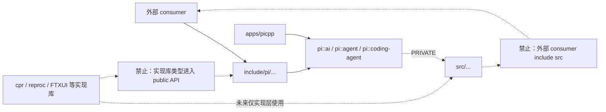

这里额外用两个“禁止”节点表示**架构约束**，而不是实际依赖边；这样既避免 Mermaid 对 `|X|` 边标签的兼容问题，也不会把禁用关系误读成正常依赖。

硬约束：

- SDK target 的 PUBLIC include path 只能指向 `include/`。
- `${PROJECT_SOURCE_DIR}/src` 不得作为 SDK PUBLIC include path。
- `cpr`、`reproc++`、`FTXUI` 等第三方实现类型不得进入 public API。
- CLI/TUI 不得 include `src/ai`、`src/agent`、`src/coding-agent` 的 private header。

这个约束在 `v0.0.1` 已经通过三组 consumer test 落成，而不是只停留在文档约定。

---

## 4. CMake SDK target

本版本即建立三个长期 target 名称：

```cmake
pi_ai           -> pi::ai
pi_agent        -> pi::agent
pi_coding_agent -> pi::coding-agent
picpp           -> executable
```

真实 CMake 依赖关系如下：

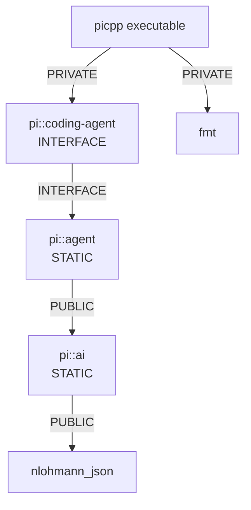

当前 `CMakeLists.txt` 中 `pi_ai` 和 `pi_agent` 都是 `STATIC` library；`coding-agent` 在 `v0.0.1` 还没有真正的 coding-domain 实现，因此使用 `INTERFACE` target：

```cmake
add_library(pi_coding_agent INTERFACE)
add_library(pi::coding-agent ALIAS pi_coding_agent)
target_link_libraries(pi_coding_agent INTERFACE pi::agent)
```

这样做的价值是：**先冻结 target 名与依赖方向，再填功能。** 到 `v0.0.4` 增加 read/write/edit/bash 时，不需要重新设计调用方的链接方式。

三个 SDK target 都显式声明自己的 build-time public include contract：

```cmake
target_include_directories(pi_ai PUBLIC
    "$<BUILD_INTERFACE:${CMAKE_CURRENT_SOURCE_DIR}/include>"
)

target_include_directories(pi_agent PUBLIC
    "$<BUILD_INTERFACE:${CMAKE_CURRENT_SOURCE_DIR}/include>"
)

target_include_directories(pi_coding_agent INTERFACE
    "$<BUILD_INTERFACE:${CMAKE_CURRENT_SOURCE_DIR}/include>"
)
```

注意 `pi_ai` / `pi_agent` 同时把 `src` 作为 **PRIVATE** include path，这允许库内部继续复用 private support，但不会把 `src/...` 传播给外部 consumer。

另外，项目级 warning-as-error 在第一版就启用：MSVC 使用 `/W4 /WX`，GCC/Clang 使用 `-Wall -Wextra -Werror`。依赖通过 `cmake/deps.cmake` 先引入，避免第三方源码被第一方的严格告警策略误伤。

`v0.1.0` 再补 `INSTALL_INTERFACE`、export targets 与 package config。

---

## 5. C++ namespace 与模块名

模块名与 pi 保持一致：

```text
ai
agent
coding-agent
```

C++ 标识符不能包含 `-`，因此 canonical namespace 是：

```cpp
pi::ai
pi::agent
pi::coding_agent
```

CMake target 名可以保留连字符：

```cmake
pi::ai
pi::agent
pi::coding-agent
```

`v0.0.1` 不提供顶层 `pi::Type` 兼容 alias。public API、测试和示例统一使用所属 SDK 的 canonical namespace，避免第一版就形成两套对外类型名称。

这种选择还能直接体现类型所有权。例如看到 `pi::ai::AssistantMessage` 就知道它可以脱离 Agent 使用；看到 `pi::agent::AgentMessage` 则说明它已经进入 Agent 语义层。

---

## 6. 类型责任划分与当前代码实现

### 6.1 ai 层：Provider/LLM 世界的值类型

`include/pi/ai/message.hpp` 负责：

```text
StopReason
Cost / Usage / Diagnostic
TextContent
ThinkingContent
ImageContent
ToolCall
ContentBlock
UserMessage
AssistantMessage
ToolResultMessage
Message
```

整体关系可以画成：

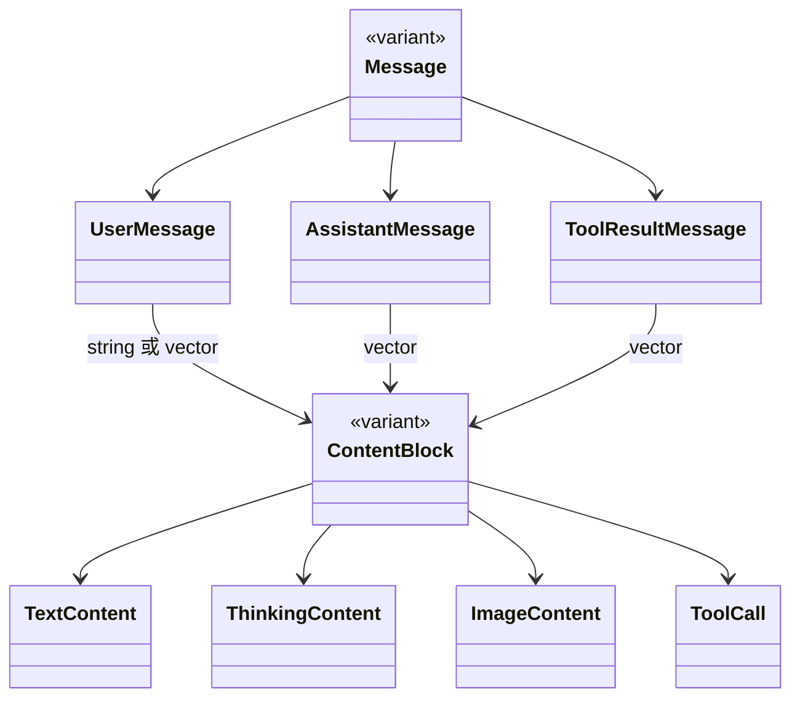

核心定义直接使用 `std::variant`：

```cpp
using ContentBlock = std::variant<
    TextContent,
    ThinkingContent,
    ImageContent,
    ToolCall>;

using Message = std::variant<
    UserMessage,
    AssistantMessage,
    ToolResultMessage>;
```

这不是简单地“用 variant 替代继承”。它刻意保留了 pi/TypeScript 中 tagged union 的语义：类型集合是封闭的，处理方通过 `std::visit` 穷举分支，新增一种 wire 类型时编译期更容易暴露遗漏。

#### StopReason 的 wire 映射

`StopReason` 用 enum 表示内部语义，同时固定 wire 字符串：

```cpp
enum class StopReason { Stop, Length, ToolUse, Error, Aborted };
```

对应：

```text
Stop     -> "stop"
Length   -> "length"
ToolUse  -> "toolUse"
Error    -> "error"
Aborted  -> "aborted"
```

其中 `toolUse` 保持 camelCase，这类细节属于 wire contract，不能因为 C++ 命名习惯而擅自改成 `tool_use`。

#### optional 字段为什么手写 JSON

`Usage::cacheWrite1h`、`AssistantMessage::responseId`、`errorMessage`、`ToolCall::thoughtSignature` 等字段都是 optional。当前实现不会把 `nullopt` 写成 JSON `null`，而是**直接省略字段**。

例如 `Usage`：

```cpp
if (u.cacheWrite1h)
    j["cacheWrite1h"] = *u.cacheWrite1h;
```

反序列化时不存在该字段就恢复为 `std::nullopt`。这样可以明确控制 pi wire 中“缺失”和“null”的区别，也避免把 nlohmann/json 对 `std::optional` 的行为当成隐含契约。

### 6.2 agent 层：在 ai::Message 之上扩展 Agent 语义

`include/pi/agent/message.hpp` 增加四种 Agent 专属消息：

```text
BashExecutionMessage
CustomMessage
BranchSummaryMessage
CompactionSummaryMessage
```

最终 `AgentMessage` 为：

```cpp
using AgentMessage = std::variant<
    ai::UserMessage,
    ai::AssistantMessage,
    ai::ToolResultMessage,
    BashExecutionMessage,
    CustomMessage,
    BranchSummaryMessage,
    CompactionSummaryMessage>;
```

关系如下：

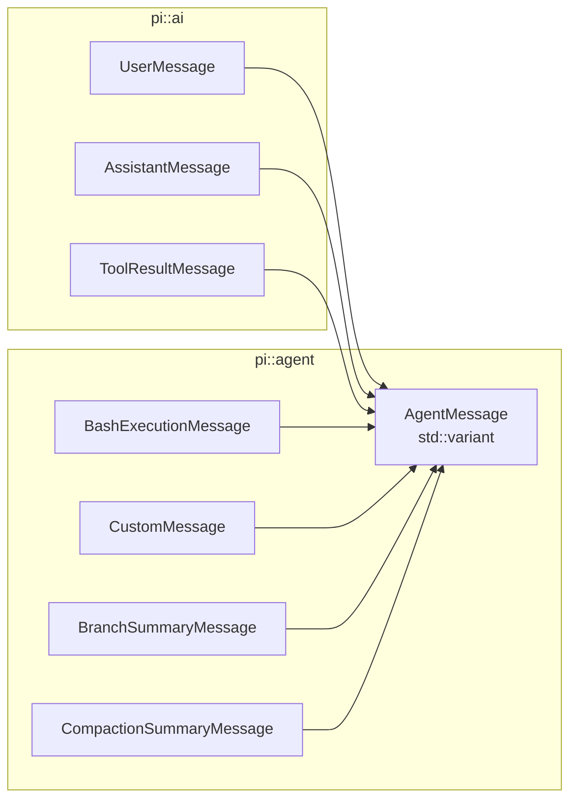

这里有一个重要设计点：`AgentMessage` **复用** `ai::UserMessage / AssistantMessage / ToolResultMessage`，而不是再复制一份结构。这让 Provider 层和 Agent 层对同一条 assistant message 使用同一个 C++ 值类型，避免后续产生两套字段同步逻辑。

`BashExecutionMessage` 已经预留 `cancelled`、`truncated`、`fullOutputPath`、`excludeFromContext` 等字段；真正执行 bash 要到 `v0.0.4`，但消息 wire 在第一版先稳定下来。

真正发给模型时，后续 Agent 会在边界处把 `AgentMessage` 降维成 LLM `Message`；branch summary、bash execution 等 Agent 内部消息是否进入模型上下文，由 Agent 层决定，而不是 Provider 层知道这些概念。

---

## 7. L1 / L2 事件分层与事件流

### 7.1 L1：ai Provider events

`include/pi/ai/events.hpp` 描述 **一条 AssistantMessage 如何被流式构造出来**：

```text
start
text_start / text_delta / text_end
thinking_start / thinking_delta / thinking_end
toolcall_start / toolcall_delta / toolcall_end
done / error
```

共 12 种。

当前每个 delta 事件不仅带增量字符串，还带 `partial: AssistantMessage`。例如：

```cpp
struct EvTextDelta {
    std::size_t contentIndex = 0;
    std::string delta;
    AssistantMessage partial;
};
```

`contentIndex` 用于指明正在更新 AssistantMessage 的哪个 content block；这为后续 text、thinking、tool call 并存的流式响应提供统一定位方式。

一个典型 L1 生命周期是：

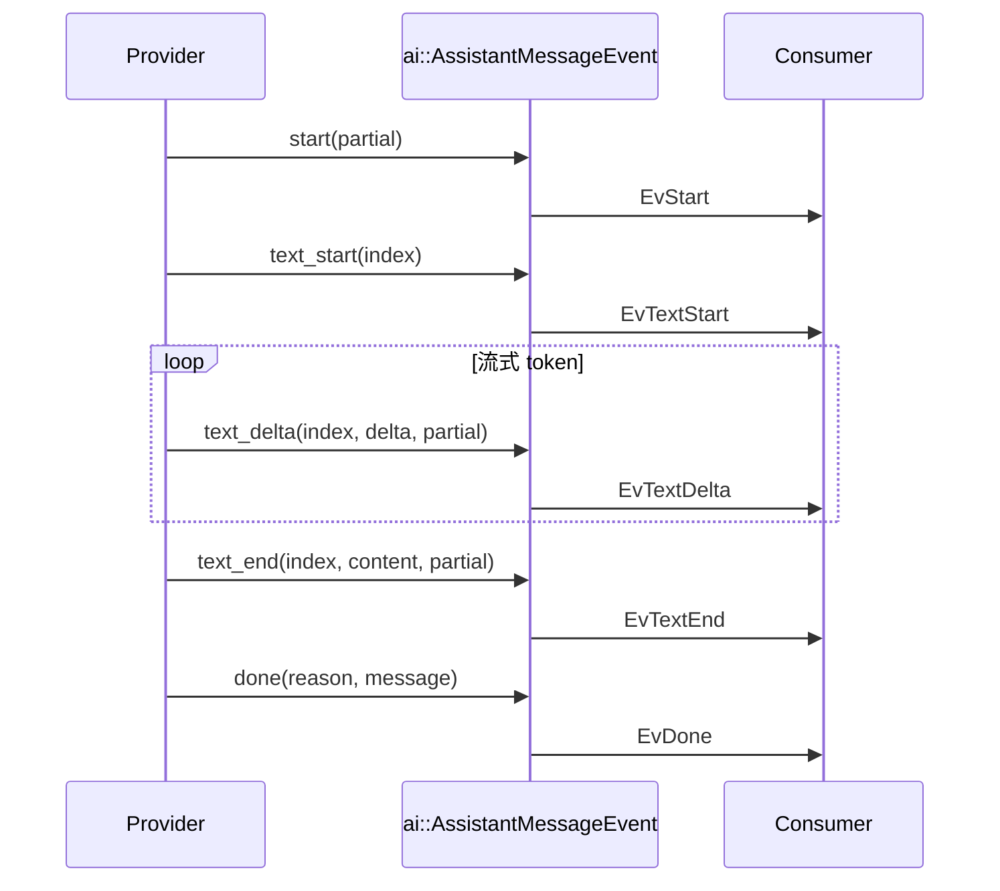

Thinking 和 ToolCall 复用完全相同的 start → delta → end 模式。

### 7.2 L2：agent events

`include/pi/agent/events.hpp` 描述 Agent 生命周期：

```text
agent_start / agent_end
turn_start / turn_end
message_start / message_update / message_end
tool_execution_start / update / end
```

共 10 种。

最关键的桥梁是：

```cpp
struct EvMessageUpdate {
    AgentMessage message;
    ai::AssistantMessageEvent assistantMessageEvent;
};
```

也就是说，L2 并没有重新定义一套 Provider delta，而是**把 L1 event 原样嵌入 Agent 的 message_update**。

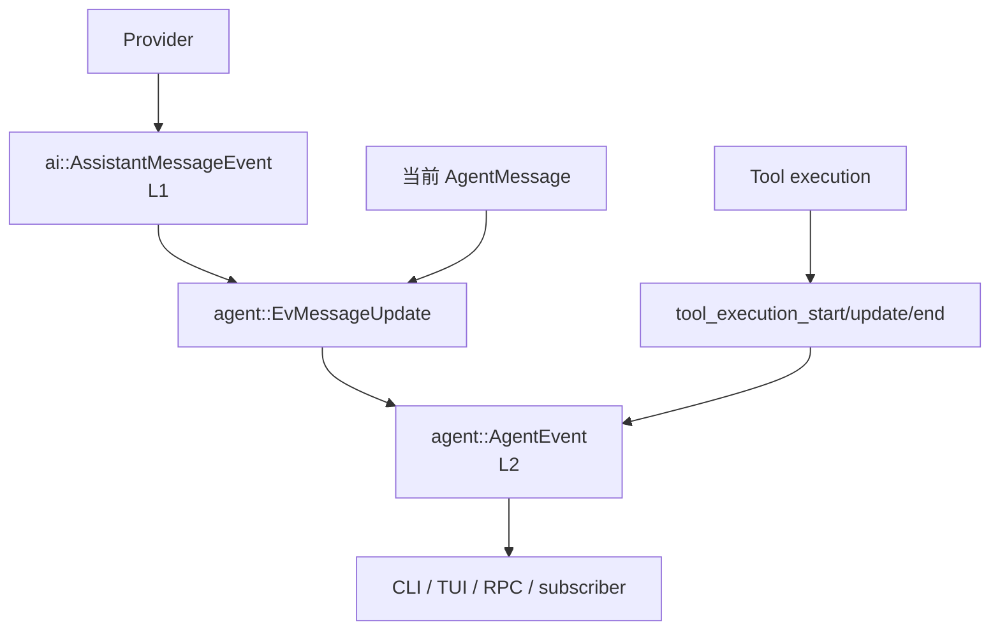

这个分层会直接影响后续实现：Provider 只负责“模型流发生了什么”，Agent 再把它包装成“Agent 这一轮发生了什么”。这样未来 TUI/RPC 订阅 L2 就能同时看到模型输出和工具执行，而单独使用 `pi::ai` 的程序只需要处理 L1。

---

## 8. wire 与 JSON 分发细节

### 8.1 规范来源

所有 wire 行为按以下优先级裁决：

> **pi `v0.80.0` 可观察行为 > pi-cpp 明确兼容规范 > Tau `v0.4.1` 实现参考**

### 8.2 判别字段

| 类型 | 判别字段 | 典型值 |
|---|---|---|
| Message / AgentMessage | `role` | user / assistant / toolResult / bashExecution / custom / branchSummary / compactionSummary |
| ContentBlock | `type` | text / thinking / image / toolCall |
| L1 event | `type` | start / text_* / thinking_* / toolcall_* / done / error |
| L2 event | `type` | agent_* / turn_* / message_* / tool_execution_* |

### 8.3 `std::variant` 如何落到 JSON tagged union

序列化不是依赖 RTTI，而是显式使用 `std::visit`：

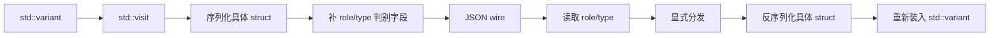

以 `ContentBlock` 为例，`src/ai/message.cpp` 中的写入逻辑类似：

```cpp
std::visit(Overload{
    [&](const TextContent& v)     { j = v; j["type"] = "text"; },
    [&](const ThinkingContent& v) { j = v; j["type"] = "thinking"; },
    [&](const ImageContent& v)    { j = v; j["type"] = "image"; },
    [&](const ToolCall& v)        { j = v; j["type"] = "toolCall"; },
}, block);
```

反向则先读 `type` 再构造具体类型。未知判别值直接抛 `std::runtime_error`，例如：

```text
unknown content block type: ...
unknown ai message role: ...
unknown agent message role: ...
unknown assistant message event type: ...
```

测试只把“未知类型必须失败且诊断中包含实际值”视为行为要求，不把完整英文错误前缀冻结成长期兼容 API。

### 8.4 为什么 serializer 分成 header 和 cpp

简单 DTO 使用 `NLOHMANN_DEFINE_TYPE_NON_INTRUSIVE_WITH_DEFAULT` 或 inline `to_json/from_json` 放在 public header 中；但 `ContentBlock`、`Message`、`AgentMessage`、L1/L2 event 这种**需要 variant 分发**的 serializer 放到 `.cpp`。

这样做有两个好处：

1. public header 只暴露类型和序列化函数声明，不把较长的分发代码复制进每个 consumer translation unit；
2. tagged-union 的 wire 映射集中在一个实现文件里，后续做 pi differential audit 时更容易逐项检查。

---

## 9. CancellationToken：当前实现与已知债

Abort/cancel 最终会贯穿：

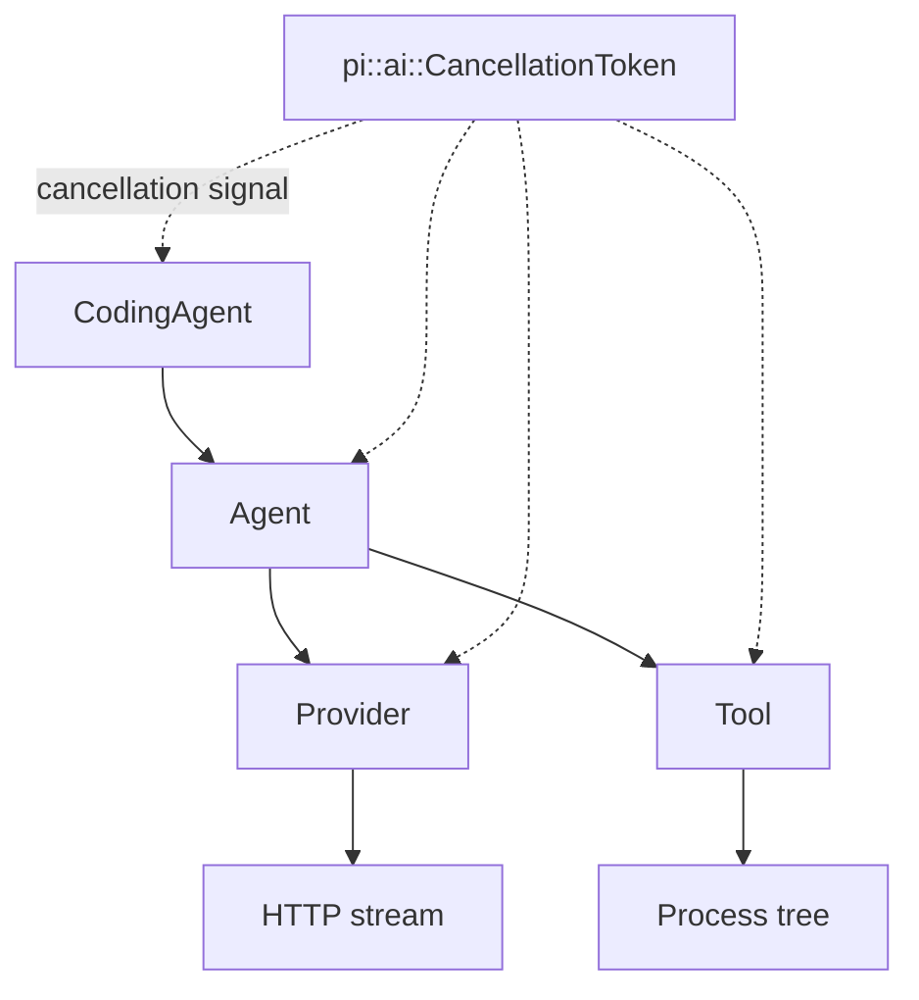

所以 `v0.0.1` 就提供：

```cpp
#include <pi/ai/cancellation.hpp>

pi::ai::CancellationToken token;
```

接口：

```cpp
void request();
bool requested() const noexcept;
bool wait_for(std::chrono::milliseconds timeout) const;
std::uint64_t registerCallback(Callback cb);
bool unregisterCallback(std::uint64_t id);
```

### 9.1 内部结构

当前 `CancellationToken` 同时使用：

- `std::atomic<bool> cancelled_`：低成本查询取消状态；
- `std::mutex`：保护 callback registry 和等待状态；
- `std::condition_variable`：支持 `wait_for()`；
- `std::map<uint64_t, Callback>`：用 id 注册/注销 callback。

请求取消的当前流程是：

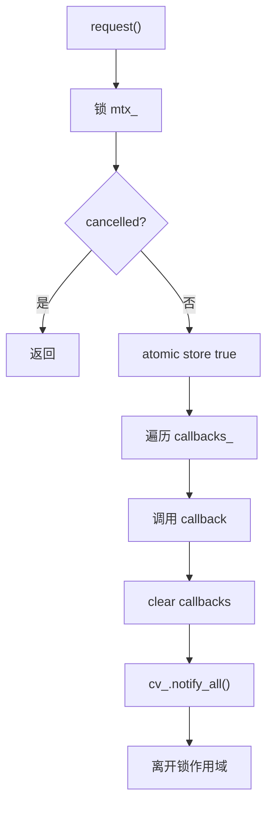

这里有一个**已经明确记录、但不在 v0.0.1 扩功能面处理的并发债**：当前 callback 是在 `mtx_` 持有期间执行的；`registerCallback()` 在 token 已取消时也会在持锁状态立即调用 callback。

因此如果 callback 重入同一个 token，例如再次调用 `registerCallback()` / `unregisterCallback()`，存在自锁风险。这个问题已经明确放在 `v0.0.2` Provider/HTTP 之前加固：

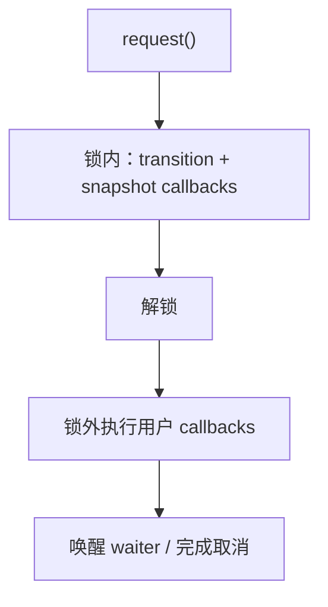

这是为什么当前文档只称其为项目自己的 C++17 cancellation abstraction，而不宣称与 `std::stop_token` 完全等价。

### 9.2 CombinedCancellation

`CombinedCancellation` 接收多个 `shared_ptr<CancellationToken>`，在每个源 token 上注册 callback：任意源取消时，请求内部 `combined_` token 取消。

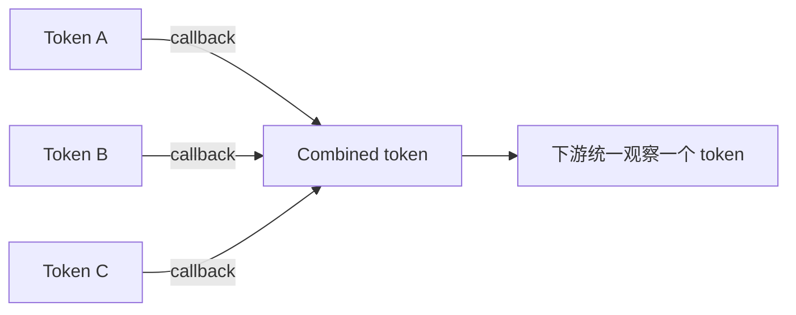

析构时会按保存的 callback id 从每个源 token 注销。这个模型后面很适合组合“用户 Abort + turn timeout + shutdown”等多个取消来源；但其析构与 request 并发的生命周期语义也会在 `v0.0.2` 一起补竞态测试。

---

## 10. fixture 与真实兼容证据

`v0.0.1` 的三个手工 JSONL fixture：

```text
session_minimal.jsonl
session_toolcall.jsonl
session_thinking.jsonl
```

只用于验证：

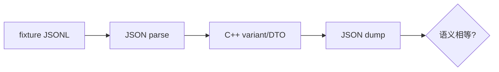

它证明当前 serializer 的 round-trip 自洽，**不构成真实 pi `v0.80.0` compatibility evidence**。

`v0.0.2` 建立真正的差分链路：

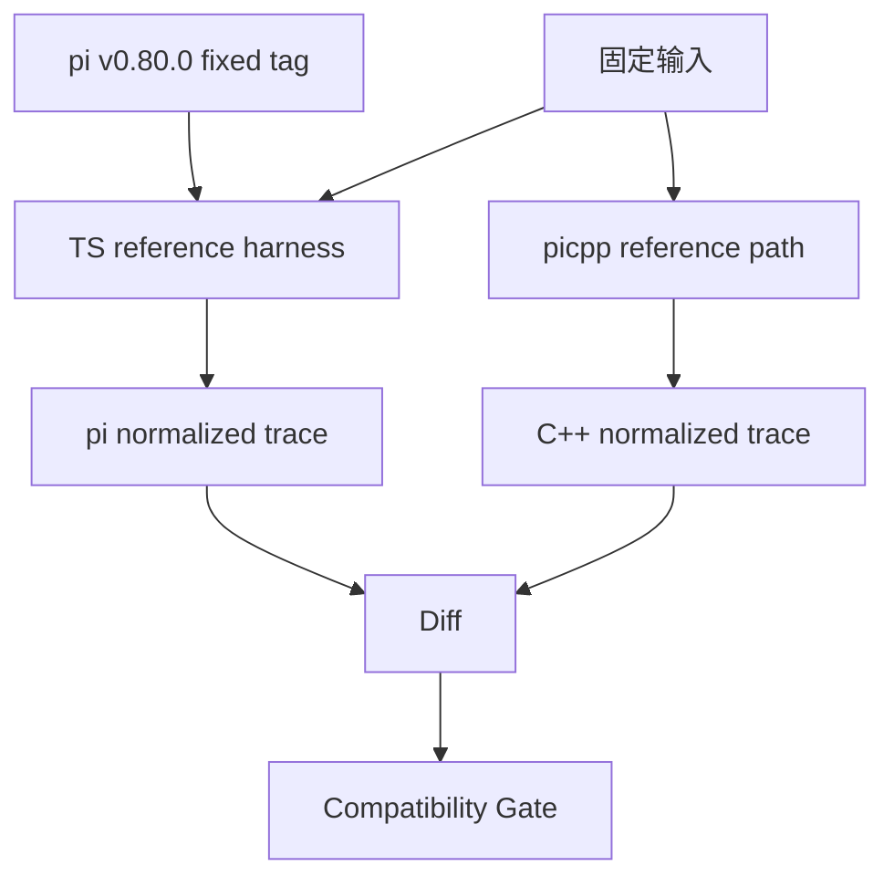

重点比较 event ordering、message fields、stopReason、tool-call 聚合等可观察语义；UUID、时间戳、duration、临时路径等非语义字段才允许 normalization。

---

## 11. 测试结构与 SDK 边界验证

当前测试不是全部统一链接最上层 target，而是刻意按责任分组：

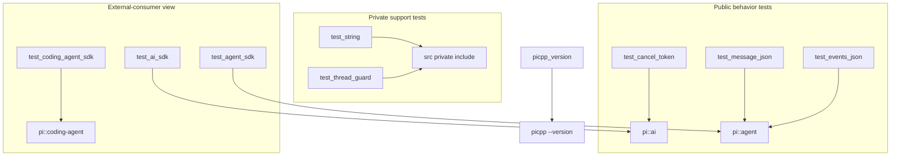

### 11.1 public behavior test

`picpp_add_test()` 不额外添加 `src/` include path，因此 message/event/cancellation 测试必须通过 `<pi/...>` canonical public header 编译。

例如：

```text
test_cancel_token -> pi::ai
test_message_json -> pi::agent
test_events_json  -> pi::agent
```

### 11.2 private support test

只有 `string` / `ThreadGuard` 这种当前仍属于 private support 的测试使用 `picpp_add_private_test()`，显式增加：

```cmake
target_include_directories(... PRIVATE "${PROJECT_SOURCE_DIR}/src")
```

这确保“内部可以测试 private helper”和“外部 SDK 不暴露 src”两个需求不会混在一起。

### 11.3 三层独立 SDK consumer test

三个 consumer 分别只链接对应层：

```text
test_ai_sdk.cpp
  -> pi::ai

test_agent_sdk.cpp
  -> pi::agent

test_coding_agent_sdk.cpp
  -> pi::coding-agent
```

其中不添加 `${PROJECT_SOURCE_DIR}/src` include path。这直接验证：

- `ai` 可以脱离 agent/coding-agent 使用；
- `agent` 只依赖 ai；
- `coding-agent` consumer 不需要 CLI/TUI；
- canonical public include 路径是真的能被外部代码消费，而不是项目内部因为 include path 过宽“碰巧能编译”。

### 11.4 CLI version 也是 CTest gate

最终 closeout 增加了：

```cmake
add_test(NAME picpp_version COMMAND $<TARGET_FILE:picpp> --version)
set_tests_properties(picpp_version PROPERTIES
    PASS_REGULAR_EXPRESSION "^picpp v0\\.0\\.1"
)
```

因此 `picpp --version` 不再只是 README 中的示例，而是三平台 CI 都会执行的 release gate。最终 CI 共 10 个 CTest entry，全部通过。

---

## 12. v0.0.1 最终验收结果

最终 closeout 验收如下；三平台 CI 证据与 tag 审计见 [`docs/closeout/v0.0.1.md`](../closeout/v0.0.1.md)。

- [x] Linux / macOS / Windows 构建测试通过。
- [x] `picpp --version` 输出 `picpp v0.0.1`，并有独立 CTest gate。
- [x] `pi::ai` 独立 target 存在。
- [x] `pi::agent` PUBLIC 依赖 `pi::ai`。
- [x] `pi::coding-agent` 依赖 `pi::agent`，不反向依赖。
- [x] 三个 SDK target 都显式声明 canonical public include root。
- [x] SDK target 不把 `src/` 设为 PUBLIC include path。
- [x] public headers 位于 `include/pi/ai`、`include/pi/agent`、`include/pi/coding-agent`。
- [x] public headers 不导出顶层 `pi::Type` compatibility aliases。
- [x] L1 12 种 / L2 10 种事件 round-trip 通过。
- [x] 7 种 AgentMessage / 4 种 ContentBlock round-trip 通过。
- [x] 三个手工 fixture round-trip 通过。
- [x] `ai` / `agent` / `coding-agent` 三个独立 consumer tests 通过。
- [x] 第一方代码保持 warning-as-error。

`v0.0.1` 功能面至此冻结；后续只允许处理重新发布 tag 的机械性操作，不再向该版本增加功能。

---

## 13. 实现中确认的工程经验

### 13.1 nlohmann/json：不要把默认行为当成 wire 契约

nlohmann/json 3.11.3 在本项目实际使用下不能直接依赖“optional 自动序列化”的假设，因此含 optional 的 DTO 明确手写 serializer；字段省略/null 语义由项目控制。

同时，variant 的 `role/type` 判别也由项目显式写入，而不是依赖库自动推断。这样做代码稍多，但 wire 语义非常清晰，也更适合后续做 pi differential compatibility。

### 13.2 CMake：target 边界比目录边界更重要

- 无源 STATIC library 在部分 CMake 版本上不可行；未有源码的 coding-agent 在本版本使用 INTERFACE target。
- 每个 SDK target 显式拥有自己的 public include contract，不依赖下层 target 的偶然传播。
- `src/` 可以被具体 library PRIVATE 使用，但不能传播给 consumer。
- FetchContent 下第三方 target 名以实际生成结果为准。
- MSVC 多配置生成器显式处理 configuration。
- 第一方 warning-as-error 与第三方构建隔离。

### 13.3 `std::variant` 比公共继承树更适合当前 wire 模型

当前 Message/Event 都是有限集合，并且 wire 本身已经有 `role/type` 标签，因此 `std::variant + std::visit` 与原模型高度一致。它避免为了序列化引入虚函数、heap ownership 和 RTTI，也让“支持了哪些消息/事件”直接体现在类型定义里。

后续真正需要运行时扩展的 Extension Tool 不一定继续使用同样方案；**固定 wire union** 和 **动态插件接口** 是两个不同问题，不应为了未来插件而把现在的消息模型设计成开放继承体系。

### 13.4 三平台从第一天开始

Windows VS 多配置、libstdc++ 与 doctest 的差异都说明：跨平台不能等功能完成后再补。`v0.0.1` 的三平台 CI 不只是发布装饰，而是后续每个版本都必须继承的基本门槛。

### 13.5 已知技术债必须明确归属版本

CancellationToken callback-under-lock 已经发现，但不在 `v0.0.1` closeout 时偷偷扩大功能范围；它被明确列入 `v0.0.2` T1，并要求在真实 HTTP 之前偿还。

这种做法比“当前能跑就先不写”更重要：设计文档既要描述现在有什么，也要准确描述现在**哪里还不安全**。

---

## 14. 下一步：v0.0.2

SDK 目录、public headers 和 CMake target 边界已由 `v0.0.1` 完成，所以 `v0.0.2` 直接聚焦：

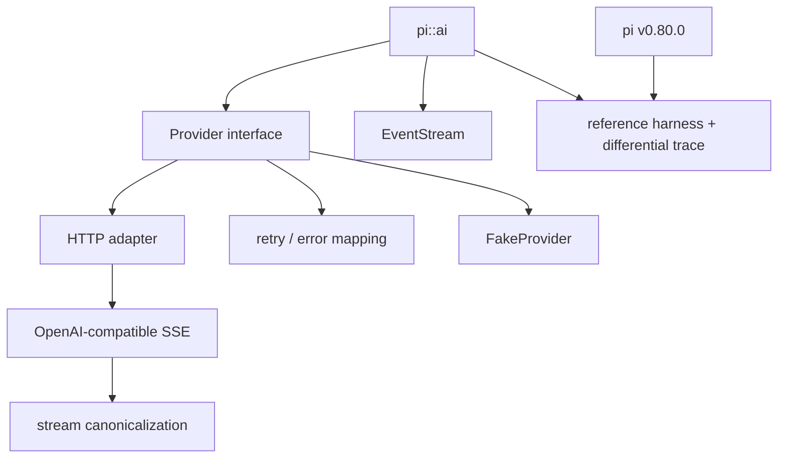

并建立：

```text
真实 pi v0.80.0 fixtures
+ reference harness
+ differential trace tests
```

同时先完成 CancellationToken callback 锁外执行和生命周期竞态加固。这样第一条真实网络请求就运行在正确 SDK 边界和更安全的取消模型中，不需要后续再做结构性搬家。