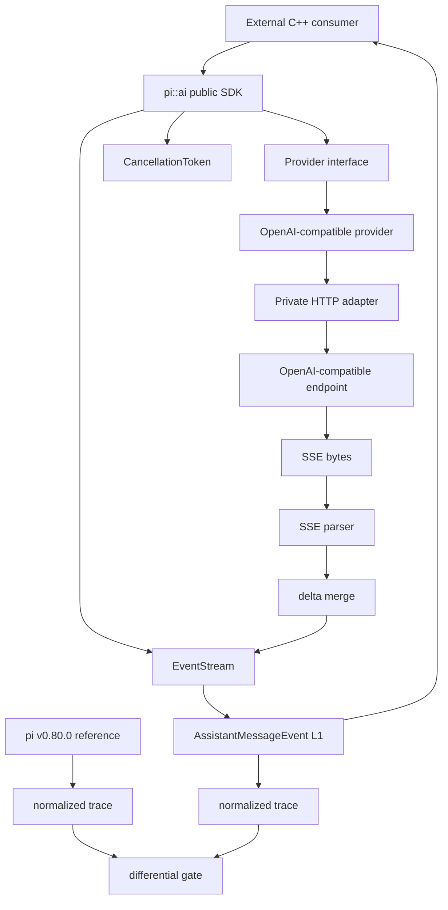
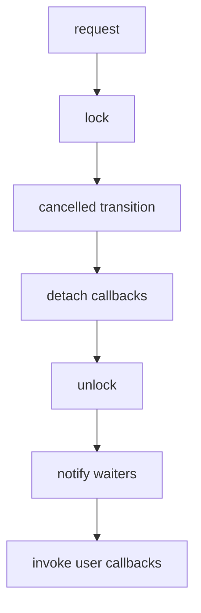
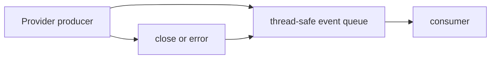
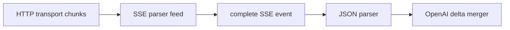

# 用 C++ 重写 pi coding agent（2）：v0.0.2 Provider / SSE + Differential 基座

> 状态：**进行中**  
> 行为语义基线：**pi `v0.80.0`**  
> 固定 commit：`f08e968c83d92bce5f5fd2f7f20ef37f8cf04a39`  
> 实现参考：Tau `v0.4.1`，仅参考实现方式，不定义行为语义  
> 上一篇：[v0.0.1 骨架、核心类型与 SDK 边界](v0.0.1.md) ｜ [项目总览](../dev-plan.md)

## 0. 本版本位置

`v0.0.1` 已经冻结三层 SDK 边界：

```text
coding-agent
     ↓
   agent
     ↓
    ai
```

`v0.0.2` 不再调整这套边界，而是在 `pi::ai` 中第一次加入真正的运行时能力：

1. 建立真实 pi `v0.80.0` differential compatibility 基座；
2. 加固 CancellationToken，使它可以安全进入 HTTP / stream 生命周期；
3. 建立 Provider interface 与 thread-safe EventStream；
4. 打通第一条 OpenAI Chat Completions compatible SSE 流；
5. 把 retry、错误分类、取消、SSE 分块等行为纳入确定性测试。

本版本仍然**不实现 Agent runLoop**。Provider 能独立被外部 C++ consumer 使用，是本版本的重要验收条件。

---

## 1. 总体架构



Public SDK 只看到 `Provider`、`EventStream`、message/event/cancellation 等项目自有类型；HTTP client、socket、curl/cpr 类型都必须停留在 `src/ai`。

---

## 2. 兼容性来源与裁决规则

本版本继续使用已经冻结的优先级：

> **pi `v0.80.0` 可观察行为 > pi-cpp 明确兼容规范 > Tau `v0.4.1` 实现参考**

真实 pi 基线固定为：

```text
repository: earendil-works/pi
tag:        v0.80.0
commit:     f08e968c83d92bce5f5fd2f7f20ef37f8cf04a39
```

任何 fixture / reference harness 都必须记录：

- 上游 repository；
- tag；
- exact commit；
- 输入数据；
- normalization 规则；
- fixture 生成命令。

不能用“当前 main 的行为”替代 `v0.80.0`。

---

## 3. 交付拆分

### T0 — 真实 compatibility 基座

目标不是一次复制 pi 全部测试，而是先建立一条以后所有版本都能复用的差分通道。

目录目标：

```text
tests/
├── fixtures/
│   └── pi-v0.80.0/
│       ├── README.md
│       ├── message/
│       ├── events/
│       └── traces/
└── reference/
    ├── pi/
    └── normalize/
```

第一阶段至少覆盖：

- Message / ContentBlock wire；
- AssistantMessageEvent ordering；
- stopReason；
- text delta 聚合；
- tool-call delta 聚合。

允许 normalization 的字段必须显式列出，例如 timestamp、duration、临时路径等。稳定业务字段不得通过 normalization 隐藏差异。

### T1 — CancellationToken 加固

这是 Provider 之前的硬门槛。

当前 `v0.0.1` 实现的问题是：用户 callback 在内部 mutex 持有期间执行。这样 callback 一旦重入 token，就可能自锁；CombinedCancellation 的 callback 捕获 `this`，在 source request 与析构竞态时也存在生命周期风险。

目标语义：



硬约束：

- 不在内部锁下执行用户代码；
- request 幂等；
- callback 保持注册顺序；
- request 与 unregister 线性化；
- register-after-cancel 同步执行，但必须锁外执行；
- CombinedCancellation callback 不捕获裸 `this`；
- source token request 与 CombinedCancellation 析构并发时不得 UAF / deadlock。

#### unregister/request 竞态语义

定义为：

- `unregisterCallback(id)` 返回 `true`：该 callback 已在 request snapshot 之前成功移除，因此之后不会执行；
- 返回 `false`：callback 不存在，可能已经被 request snapshot，也可能已执行；调用方不能再假设它会被阻止；
- 每个成功注册且未成功 unregister 的 callback 最多执行一次。

#### 生命周期边界

`CancellationToken` 自身的对象生命周期仍由调用方管理：不允许在对象已经进入析构后继续调用其成员函数。这里要解决的是**存活对象之间**的 request/register/unregister 并发，以及 CombinedCancellation 内部回调不访问已析构 owner。

### T2 — Provider API / EventStream

Public surface 目标：

```text
include/pi/ai/provider.hpp
include/pi/ai/event_stream.hpp
```

Provider interface 必须满足：

- 输入使用 pi-cpp 自有 model/message/options 类型；
- 输出为 `AssistantMessageEvent` stream；
- cancellation 使用 `CancellationToken`；
- public header 不出现 cpr/curl/HTTP client 类型；
- FakeProvider 可以在不联网时驱动测试和后续 Agent loop。

EventStream 目标模型：



需要定义：

- push；
- blocking next / wait；
- close；
- terminal error；
- 多次 close 幂等；
- cancel 后 consumer 不永久阻塞。

### T3 — OpenAI-compatible SSE

第一条真实协议只做 OpenAI Chat Completions compatible 子集。

内部结构目标：

```text
OpenAICompatibleProvider
        ↓
private request builder
        ↓
private HTTP adapter
        ↓
raw response chunks
        ↓
SSE parser
        ↓
JSON chunk parser
        ↓
delta merger
        ↓
AssistantMessageEvent
```

SSE parser 必须独立于具体 HTTP client，可用纯字符串/字节 chunk 做 deterministic tests。

重点覆盖：

- 一个 SSE event 被拆到多个 transport chunk；
- 一个 transport chunk 包含多个 SSE event；
- CRLF / LF；
- 多 `data:` 行；
- 空行结束 event；
- `[DONE]`；
- malformed JSON；
- text delta；
- thinking/reasoning delta 的兼容字段；
- tool_calls 按 index/id/name/arguments 聚合；
- finish_reason → `StopReason`；
- usage；
- 401 / 429 / 5xx / transport failure / cancellation。

---

## 4. Provider API 的最小原则

`v0.0.2` 不急于设计最终所有 Provider 的大而全接口。第一版 public API 只冻结真正跨 Provider 的概念。

建议模型：

```cpp
class Provider {
public:
    virtual ~Provider() = default;

    virtual EventStream stream(
        const Model& model,
        const std::vector<Message>& messages,
        const StreamOptions& options,
        std::shared_ptr<CancellationToken> cancellation) = 0;
};
```

最终具体签名以实现阶段 compile/test 反馈为准，但必须保持以下原则：

- ownership 明确；
- stream 可以跨线程生产；
- cancellation 生命周期不会悬空；
- Provider 实现错误转为 terminal event/error，而不是让后台线程静默 terminate；
- 后续 Agent 不需要知道 HTTP 细节。

---

## 5. EventStream 并发模型

EventStream 本质上是一个**单逻辑流、多线程安全生产/消费**的消息通道，而不是通用任务调度器。

内部可以使用 shared state：

```text
EventStream handle
      ↓ shared_ptr
EventStreamState
  - mutex
  - condition_variable
  - deque<AssistantMessageEvent>
  - closed
  - terminal error
```

这样 Provider worker 可以持有 producer handle，consumer 可以持有 stream handle，避免返回对象后后台线程捕获局部引用。

本版本暂不做：

- fan-out broadcaster；
- 多 consumer load balancing；
- coroutine API；
- lock-free queue。

这些都不是 pi compatibility 的必要条件。

---

## 6. SSE 与 transport 分层

SSE parser 不应该知道 socket/curl/cpr。



这样可以分别测试：

1. HTTP adapter 是否正确把 bytes 交给 parser；
2. SSE parser 是否正确处理任意 chunk 边界；
3. OpenAI JSON delta 是否正确映射成 pi L1 event。

如果把三者写成一个大 callback，跨 chunk bug、协议 bug、HTTP bug 会混在一起，很难做 differential audit。

---

## 7. Retry 与错误分类

Retry 必须建立在明确错误类别上，而不是“任何失败都再试一次”。

初始分类：

```text
AuthError          401 / 403          no retry
RateLimitError     429                retryable
ServerError        5xx                retryable
TransportError     connect/reset      retryable when safe
ProtocolError      malformed SSE/JSON normally no retry
Cancelled          cancellation       no retry
```

重试必须：

- 尊重 `Retry-After`；
- 有最大次数；
- exponential backoff；
- jitter；
- backoff wait 可取消；
- 测试使用 injectable clock/sleeper 或确定性策略，不能让单测真实 sleep 很久。

---

## 8. 真实 differential trace

reference harness 输出统一 JSONL trace，不直接比较终端文本。

示例结构：

```json
{"kind":"event","type":"start"}
{"kind":"event","type":"text_start","contentIndex":0}
{"kind":"event","type":"text_delta","contentIndex":0,"delta":"hel"}
{"kind":"event","type":"text_delta","contentIndex":0,"delta":"lo"}
{"kind":"event","type":"text_end","contentIndex":0,"content":"hello"}
{"kind":"event","type":"done","stopReason":"stop"}
```

比较重点是：

- event type 与顺序；
- contentIndex；
- delta 内容；
- 聚合后的 content/tool call；
- stopReason；
- usage 的稳定字段。

这套 gate 从 `v0.0.2` 起成为后续 `v0.0.3` Agent loop、`v0.0.4` tools 等版本的共同 compatibility 基础。

---

## 9. 测试策略

### 9.1 T1 cancellation

新增测试至少包含：

- callback 内重入 `request()`；
- callback 内 `registerCallback()`；
- register-after-cancel callback 能重入 token；
- unregister 赢得竞态时 callback 不执行；
- request 赢得竞态时 callback 最多一次；
- CombinedCancellation source request 与析构并发 stress；
- 多 source 同时 request，combined callback 只触发一次。

### 9.2 T2 EventStream

- producer/consumer；
- close 唤醒 waiter；
- terminal error 唤醒 waiter；
- close 幂等；
- move/copy ownership 语义；
- consumer 不访问 private HTTP 类型。

### 9.3 T3 SSE

全部协议边界优先使用 fixture，不依赖公网：

```text
raw chunks -> parser -> events -> expected trace
```

真实 endpoint smoke test 只作为补充，不替代 deterministic unit tests。

---

## 10. CMake 与依赖原则

现有：

```text
nlohmann/json
fmt
doctest
```

HTTP 依赖在实现 T3 时再引入，并满足：

- exact version/tag pin；
- private link；
- public headers 不 include 三方 HTTP header；
- Linux/macOS/Windows CI 都能构建；
- 不为了方便把整个 `src/` 变成 public include。

在 T1/T2 完成前不引入 HTTP 依赖，避免并发基础设施和网络依赖同时变化。

---

## 11. 实施顺序

严格按下面顺序推进：

```text
T0 baseline metadata
      ↓
T1 cancellation hardening
      ↓
T2 Provider + EventStream
      ↓
T3 SSE parser
      ↓
OpenAI delta merge
      ↓
private HTTP adapter
      ↓
retry/error mapping
      ↓
real endpoint smoke
      ↓
differential closeout
```

第一阶段不追求“尽快发请求”，而是确保第一条真实 HTTP 请求出现时，取消、stream、错误传播、测试边界已经正确。

---

## 12. v0.0.2 验收条件

- [ ] pi `v0.80.0` exact tag/commit 与 fixture 来源固化。
- [ ] 至少一组真实 pi normalized trace 可重复生成。
- [ ] CancellationToken 不在锁内执行用户 callback。
- [ ] CancellationToken 重入 / request-unregister race 测试通过。
- [ ] CombinedCancellation request/destructor 竞态无 UAF / deadlock。
- [ ] `<pi/ai/provider.hpp>` public consumer test 通过。
- [ ] `<pi/ai/event_stream.hpp>` 并发测试通过。
- [ ] SSE parser 对任意 transport chunk 边界稳定。
- [ ] text / thinking / tool-call delta 聚合测试通过。
- [ ] finish_reason / usage 映射测试通过。
- [ ] 401 / 429 / 5xx / transport / cancel 错误路径有测试。
- [ ] OpenAI-compatible endpoint 可真实增量输出。
- [ ] `pi::ai` 仍可独立消费，不依赖 agent/coding-agent。
- [ ] Linux / macOS / Windows CI 全绿。

---

## 13. 当前第一步

`v0.0.2` 的第一个代码提交只做 **T1 CancellationToken hardening**，不同时引入 EventStream 或 HTTP。

原因很简单：Provider、SSE、retry/backoff 都会依赖取消语义。如果先把网络代码建立在 callback-under-lock 的 token 上，再回头修取消，会让网络线程、stream close、retry wait 一起参与竞态，修复成本更高。
