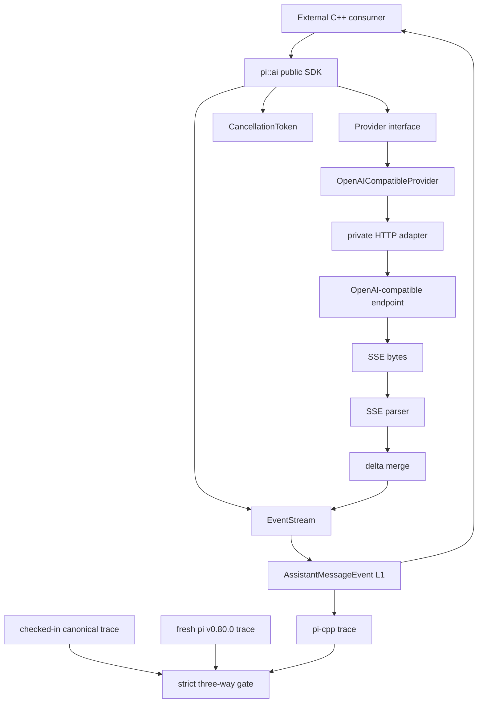
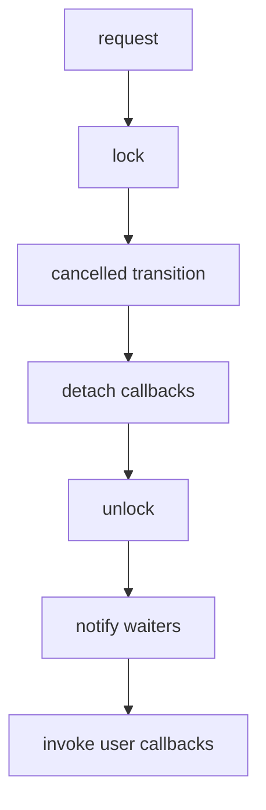

# 用 C++ 重写 pi coding agent（2）：v0.0.2 Provider / SSE + Differential 基座

> 状态：**实现、兼容性与文档 Final closeout 完成；待最终 PR head checks / merge**  
> 行为语义基线：**pi `v0.80.0`**  
> 固定 commit：`f08e968c83d92bce5f5fd2f7f20ef37f8cf04a39`  
> 实现参考：Tau `v0.4.1`，仅参考实现方式，不定义行为语义  
> 上一篇：[v0.0.1 骨架、核心类型与 SDK 边界](v0.0.1.md) ｜ [项目总览](../dev-plan.md)

## 0. 本版本位置

`v0.0.1` 冻结三层 SDK 边界：

```text
coding-agent
     ↓
   agent
     ↓
    ai
```

`v0.0.2` 不改变这套边界，而是在 `pi::ai` 中加入第一组真实运行时能力：

1. 建立真实 pi `v0.80.0` differential compatibility 基座；
2. 加固 CancellationToken，使它可以安全进入 HTTP / stream 生命周期；
3. 建立 Provider interface 与 thread-safe EventStream；
4. 打通 OpenAI Chat Completions compatible SSE 流；
5. 把 retry、错误分类、取消、SSE 分块和 delta 聚合纳入确定性测试。

本版本仍然**不实现 Agent runLoop**。Provider 能独立被外部 C++ consumer 使用，是本版本的重要验收条件。

---

## 1. 总体架构



Public SDK 只看到项目自有类型；cpr/curl/socket/HTTP adapter 等实现细节必须停留在 `src/ai`。

---

## 2. 兼容性来源与裁决规则

继续使用已经冻结的优先级：

> **pi `v0.80.0` 可观察行为 > pi-cpp 明确兼容规范 > Tau `v0.4.1` 实现参考**

真实 pi 基线固定为：

```text
repository: earendil-works/pi
tag:        v0.80.0
commit:     f08e968c83d92bce5f5fd2f7f20ef37f8cf04a39
package:    @earendil-works/pi-ai 0.80.0
```

不能用上游当前 `main`、较新 tag 或 Tau 的行为替代该基线。

---

## 3. T0 — 真实 differential compatibility 基座

### 3.1 当前实现

T0 已经不是手写 fixture 对比，而是实际执行 exact pi source：

```text
tests/reference/scenarios/openai.json
          │
          ├─ local deterministic HTTP/SSE server
          │      └─ pi v0.80.0 source runner
          │              └─ normalized JSONL
          │
          └─ same local HTTP/SSE server
                 └─ pi-cpp public OpenAICompatibleProvider
                         └─ normalized JSONL
```

reference runner 直接从 exact checkout 导入：

```text
packages/ai/src/api/openai-completions.ts
```

并在运行前验证：

- `git rev-parse HEAD == f08e968...`；
- `packages/ai/package.json` version 为 `0.80.0`；
- Node / `tsx` reference 环境可用。

### 3.2 canonical trace 三方 gate

首次真实 differential 先产生 workflow artifact，人工核对后已把 reference 侧 trace 固化到：

```text
tests/fixtures/pi-v0.80.0/traces/
├── text-stop.jsonl
├── tool-call.jsonl
└── length-stop.jsonl
```

CI 现在验证：

```text
checked-in canonical fixture
            ==
fresh exact pi v0.80.0 execution
            ==
current pi-cpp execution
```

这样可以同时防止两类问题：

1. pi-cpp 偏离固定上游行为；
2. reference runner / normalization 被误改，导致“双方一起变错”仍然绿灯。

### 3.3 第一批 canonical 场景

- `text-stop`：两个 text delta、usage、正常 stop；
- `tool-call`：arguments 跨 SSE delta，包含 partial JSON 状态；
- `length-stop`：`finish_reason=length`。

真实差分在建立过程中实际发现并修复了两个可观察行为差异：

- `text_start.partial` 在 pi v0.80.0 中已经包含首个 text delta；
- `toolcall_start.partial.arguments` 在 pi v0.80.0 中已经包含首轮 partial JSON 解析结果。

这说明 differential gate 不是形式检查，而确实能够发现单元测试未冻结的行为细节。

### 3.4 normalization 边界

当前 normalization 只排除本 gate 不关心且非确定的字段，例如 timestamp 和 monetary cost；稳定业务字段必须保留。

严格比较：

- event type / ordering；
- `contentIndex`；
- 每个 streaming event 的 normalized `partial`；
- text / thinking / tool-call delta；
- 聚合后的 content；
- tool-call id/name/arguments；
- `responseId` / `responseModel`；
- `stopReason`；
- input/output/cacheRead/cacheWrite/totalTokens；
- terminal error message。

JSON 形式的 `thoughtSignature` 按 JSON 语义归一化；非 JSON opaque signature 仍按字符串比较。

---

## 4. T1 — CancellationToken 加固

`v0.0.1` 的主要债务是 callback 在内部 mutex 持有期间执行，以及 CombinedCancellation callback 捕获裸 `this`。

`v0.0.2` 的目标语义已经实现：



硬约束：

- 不在内部锁下执行用户代码；
- request 幂等；
- callback 保持注册顺序；
- request / unregister 有明确线性化语义；
- register-after-cancel 同步执行，但锁外执行；
- callback 可以重入 request/register；
- CombinedCancellation 不通过裸 `this` 访问已析构 owner；
- source request 与 CombinedCancellation 析构并发无 UAF/deadlock。

`unregisterCallback(id)` 返回 `true` 表示它在 request snapshot 前成功移除，因此之后不会执行；返回 `false` 时 callback 可能已经被 snapshot 或已经执行。

---

## 5. T2 — Provider API / EventStream

Public surface：

```text
include/pi/ai/provider.hpp
include/pi/ai/event_stream.hpp
include/pi/ai/openai_compatible.hpp
```

Provider 输入和输出只使用 pi-cpp 自有类型。`tests/consumer/test_ai_sdk.cpp` 从纯 public header 消费 `Provider`、`EventStream` 和 `OpenAICompatibleProvider`，用于防止 private HTTP 类型泄漏。

EventStream 使用 shared state，提供 FIFO、blocking `next()`、terminal result/error、复制 handle 共享状态以及 producer/consumer 跨线程唤醒。


本版本不做 fan-out broadcaster、协程 API、lock-free queue 等非兼容性必需能力。

---

## 6. T3 — OpenAI-compatible SSE

实现链路：

```text
OpenAICompatibleProvider                 // public facade，命名参考 Tau
        ↓
OpenAIProviderCore                       // private lifecycle / retry orchestration
        ↓
request builder + private HTTP transport
        ↓
raw response chunks
        ↓
SSE parser
        ↓
OpenAIChatCompletionsDecoder             // private protocol decoder
src/ai/openai_completions_decoder.*      // 对应 pi 的 openai-completions 命名
        ↓
AssistantMessageEventStream
```

这里有意区分两个命名层次：

- `OpenAICompatibleProvider` / `include/pi/ai/openai_compatible.hpp` 表示对外的 OpenAI-compatible Provider 能力边界，命名与 Tau `v0.4.1` 的 Provider facade 保持一致；
- `OpenAIChatCompletionsDecoder` / `src/ai/openai_completions_decoder.*` 表示 private Chat Completions 协议解码职责，对应 pi `v0.80.0` 的 `openai-completions.ts` 协议命名。

因此 public 与 private 不再使用同一个 `openai_compatible` basename，避免 Provider facade 与协议 decoder 职责混淆。

SSE parser 与 HTTP client 解耦，已经覆盖：

- 单字节级 arbitrary transport chunk boundary；
- 一个 chunk 多个 SSE event；
- CRLF / LF 以及跨 chunk CRLF；
- 多 `data:` 行；
- comment/id/event/retry；
- `[DONE]`；
- malformed / incomplete input 边界。

OpenAI delta 侧覆盖 text、thinking/reasoning、tool_calls、partial JSON、finish_reason、usage、response id/model 以及 terminal error。

真实 T0 harness 通过本地 HTTP/SSE server 调用**public** `OpenAICompatibleProvider`，因此同时覆盖真实 HTTP adapter、SSE parser、`OpenAIChatCompletionsDecoder` 和 EventStream，而不是绕过 transport 直接调用 private decoder。

---

## 7. Retry 与错误分类

这里必须以 pi v0.80.0 的 OpenAI 路径真实行为为准。该路径由 `openai-node 6.26.0` 提供 HTTP retry 语义。

### 7.1 retryable 条件

当前兼容规则：

```text
408                 retryable
409                 retryable
429                 retryable
>= 500              retryable
401 / 403            no retry
transport failure    retryable only before usable response / stream start
cancelled            no retry
```

`x-should-retry: true|false` 显式覆盖默认 status 分类。

server delay 解析顺序：

1. `retry-after-ms`；
2. `Retry-After` 数字秒；
3. `Retry-After` HTTP-date；
4. 否则 exponential backoff + jitter。

指数退避与上游兼容测试覆盖 500ms 起步、指数增长以及 8s cap。OpenAI 路径当前也**不使用 `StreamOptions::maxRetryDelay` 去截断 server 指定的 Retry-After**。

### 7.2 cancellation 的重要边界

旧文档中的“backoff wait 可取消”描述过强，已经纠正。

固定基线的 openai-node retry sleep 本身不会被 AbortSignal 提前唤醒。取消在 sleep 结束、进入下一次请求之前被观察；in-flight HTTP 取消仍然正常映射为 aborted。

因此 pi-cpp 默认行为不能为了“更先进”而把 mid-sleep cancellation 当成兼容语义。测试中的 injectable sleeper 可以用来确定性模拟取消/失败，但那是测试控制点，不代表上游公开语义比实际更强。

---

## 8. 测试结构

当前主要测试面：

```text
test_cancel_token
        ├─ reentry
        ├─ register-after-cancel
        ├─ request/unregister race
        └─ CombinedCancellation destructor race

test_event_stream
        ├─ FIFO
        ├─ terminal result/error
        └─ blocking wake-up

test_sse_parser
        └─ arbitrary chunk boundaries / SSE grammar

test_streaming_json
        └─ partial JSON

test_openai_request
        └─ request/body/header conversion

test_openai_completions_decoder
        └─ text/thinking/finish/usage/error

test_openai_tool_streaming
        └─ tool-call partial aggregation

test_retry
        └─ OpenAI retry classification/delay

test_openai_provider
        └─ provider + transport + retry/error integration

test_ai_sdk
        └─ public-only SDK consumer

Compatibility workflow
        └─ exact pi v0.80.0 real differential
```

协议测试优先使用 deterministic local input，不依赖公网模型响应。

---

## 9. CMake 与依赖边界

HTTP 实现依赖保持 private；public headers 不导出 cpr/curl 类型。`pi_reference_trace` 在 Linux/macOS/Windows 都参与编译，但 exact pi differential 只在 Linux Compatibility workflow 中执行，避免三平台重复安装上游 Node workspace。

依赖方向仍然是：

```text
external app / picpp
        ↓
coding-agent
        ↓
agent
        ↓
ai
```

`pi::ai` 必须可以独立消费。

---

## 10. 实施顺序与最终形态

实际推进顺序保持“先并发基础，再网络，再真实差分”的原则：

```text
T1 cancellation hardening
      ↓
T2 Provider + EventStream
      ↓
T3 SSE / delta / HTTP
      ↓
retry + error mapping
      ↓
real differential harness
      ↓
根据真实 trace 修 observable mismatch
      ↓
pin canonical traces
      ↓
three-way compatibility gate
```

T0 的 metadata 很早就固定，但**真实 executable differential** 放在 Provider/HTTP 链路可运行后完成，这样比较的是 public end-to-end 行为，而不是手工模拟 decoder。

---

## 11. v0.0.2 验收条件

- [x] pi `v0.80.0` exact tag/commit 与 fixture 来源固化。
- [x] 真实 pi normalized trace 可重复生成，并已有三组 canonical trace。
- [x] checked-in fixture == fresh pi v0.80.0 == pi-cpp 三方 gate 通过。
- [x] CancellationToken 不在锁内执行用户 callback。
- [x] CancellationToken 重入 / request-unregister race 测试通过。
- [x] CombinedCancellation request/destructor 竞态测试通过。
- [x] `<pi/ai/provider.hpp>` public consumer test 通过。
- [x] `<pi/ai/event_stream.hpp>` 并发测试通过。
- [x] SSE parser 对任意 transport chunk 边界稳定。
- [x] text / thinking / tool-call delta 聚合测试通过。
- [x] finish_reason / usage 映射测试通过。
- [x] 401 / 429 / 5xx / transport / cancel 错误路径有测试。
- [x] 408 / 409 / `x-should-retry` / `retry-after-ms` 兼容语义有测试。
- [x] OpenAI-compatible public Provider 通过真实本地 HTTP/SSE 增量链路验证。
- [x] `pi::ai` 可独立消费，不依赖 agent/coding-agent。
- [x] Linux / macOS / Windows code-only CI 已全绿。
- [x] exact pi v0.80.0 Compatibility workflow 已全绿。

---

## 12. Final closeout 状态

`v0.0.2` 的功能、兼容性、文档与最终 diff audit 已完成，功能面不再扩张。当前仅剩发布流程动作：

1. 最终 PR head 的 CI / Compatibility 保持 green；
2. 合并 `feature/v0.0.2` → `main`；
3. 合并后在最终 `main` commit 上创建 `v0.0.2` tag；
4. 然后再开始 `v0.0.3` Agent runLoop。

后续 compatibility 开发继续遵守：**真实 pi 可观察行为优先，normalized fixture 只能记录行为，不能替行为辩护。**
