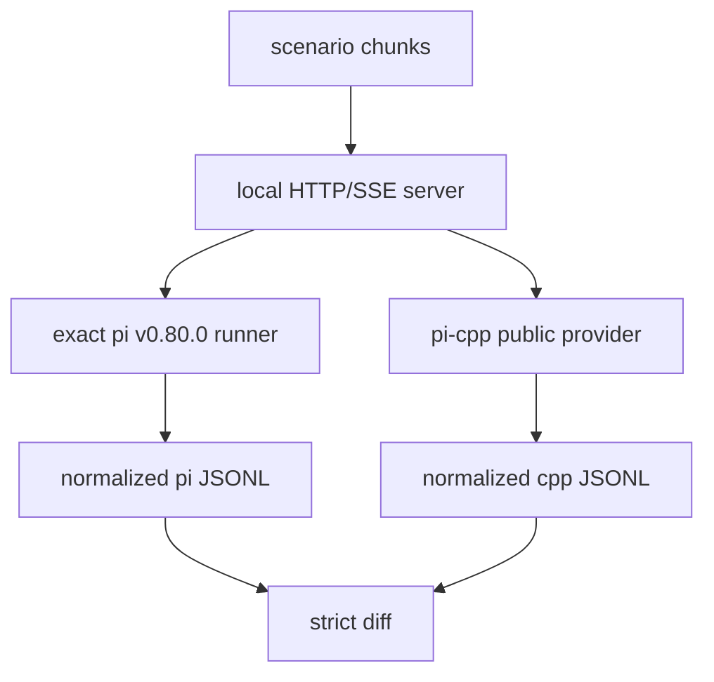

# Differential Compatibility Testing：用真实上游行为约束重写实现

> 建立版本：v0.0.2。  
> 当前基线：pi `v0.80.0` / `f08e968c83d92bce5f5fd2f7f20ef37f8cf04a39`。  
> 主要代码：`tests/reference/*`、`tests/fixtures/pi-v0.80.0/*`、`.github/workflows/compatibility.yml`。

## 1. 为什么需要 differential test

把一个已有项目重写成另一种语言时，最常见的误区是：

```text
读上游源码
   ↓
理解逻辑
   ↓
在新语言中“等价实现”
   ↓
单元测试通过
   ↓
认为兼容
```

这只能证明“新实现符合我们对上游的理解”，不能证明“新实现的可观察行为真的和上游一致”。

pi-cpp 的兼容目标因此采用：

> 真实上游执行结果作为最终裁决，而不是源码翻译结果作为最终裁决。

固定优先级：

```text
pi v0.80.0 observable behavior
        >
pi-cpp explicit compatibility spec
        >
Tau v0.4.1 implementation pattern
```

## 2. 为什么必须固定 exact commit

只写：

```text
pi v0.80.0
```

还不够。Reference runner 会验证：

```text
repository: earendil-works/pi
tag:        v0.80.0
commit:     f08e968c83d92bce5f5fd2f7f20ef37f8cf04a39
package:    @earendil-works/pi-ai 0.80.0
```

原因是：

- upstream main 会继续变化；
- tag 名称不能替代 exact source identity；
- compatibility bug 排查需要能够复现完全相同的参考实现；
- 文档、fixture、CI 必须引用同一个基线。

如果以后升级兼容基线，应作为显式版本决策，而不是 reference runner 悄悄跟随上游最新代码。

## 3. 为什么不用公网模型做 compatibility gate

直接调用真实 OpenAI / 其它模型有几个问题：

- 输出非确定；
- 模型版本可能变化；
- 网络错误不可控；
- 速率限制影响 CI；
- 需要 secrets；
- 很难精确控制 SSE chunk 边界；
- 无法稳定复现 partial JSON / finish_reason 等边界。

因此 v0.0.2 使用 deterministic local HTTP/SSE server：



同一组 wire bytes 同时喂给两边，消除模型本身的不确定性。

## 4. Reference Harness 结构

当前目录：

```text
tests/reference/
├── scenarios/
│   └── openai.json
├── pi/
│   └── runner.ts
├── cpp/
│   └── trace_main.cpp
└── run_differential.py
```

### 4.1 scenario

`scenarios/openai.json` 描述 deterministic HTTP body chunks。

这里的 chunk 是**transport chunk**，可以故意：

- 一条 SSE 被拆成多个 chunk；
- 一个 chunk 包含多条 SSE；
- tool arguments 跨多次 delta；
- finish_reason 单独出现。

### 4.2 pi runner

`runner.ts` 直接从 exact checkout 导入：

```text
packages/ai/src/api/openai-completions.ts
```

不是复制一份上游逻辑，也不是调用 pi-cpp fixture。

### 4.3 C++ runner

`trace_main.cpp` 只使用 public SDK：

```text
<pi/ai/openai_compatible.hpp>
<pi/ai/provider.hpp>
```

然后真正构造 `OpenAICompatibleProvider`。

这样 differential 同时覆盖：

```text
public Provider facade
HTTP adapter
SSE parser
streaming JSON
decoder
EventStream
```

而不是只比较 private decoder。

## 5. 为什么要 normalization

两种实现即使语义一致，也可能存在不适合严格比较的字段：

- timestamp；
- monetary cost 浮点表现；
- JSON 对象键顺序；
- 某些纯运行环境字段。

所以 trace 会先变成 canonical semantic form。

但 normalization 有一个很大的风险：

> 为了让测试通过，不断删字段，最后把真实差异也删掉。

因此必须坚持 **allow-list normalization**：只明确删除已证明非目标且非确定的字段，不能采用“只保留几个字段”的无限收缩策略。

## 6. 当前严格比较的字段

v0.0.2 normalized trace 保留：

```text
event type
ordering
contentIndex
delta
content
partial message
final message/toolCall
api
provider
model
responseId
responseModel
stopReason
errorMessage
usage.input
usage.output
usage.cacheRead
usage.cacheWrite
usage.totalTokens
content blocks
thinking/tool signatures
```

不比较 timestamp 和 monetary cost。

JSON 形式的 `thoughtSignature` 会先解析成 JSON semantic value，因此对象键顺序不会制造假差异；非 JSON opaque signature 仍按原字符串比较。

## 7. 为什么做三方 gate，而不是只比较 upstream == cpp

最初的两方比较是：

```text
fresh pi == pi-cpp
```

它能发现 pi-cpp 偏离上游，但有一个漏洞：

```text
reference runner 改错
normalization 改错
pi-cpp runner 同时跟着改
```

双方可能“共同变错”，仍然 green。

因此最终 gate 是：

```text
checked-in canonical fixture
            ==
fresh exact pi v0.80.0 trace
            ==
current pi-cpp trace
```

三者职责不同：

```text
fixture   → 冻结已人工审计的 canonical history
fresh pi  → 证明 reference runner 仍然真实代表 fixed upstream
pi-cpp    → 证明当前实现仍然匹配 reference
```

## 8. Canonical fixture 不是手写答案

fixture 的来源纪律：

```text
真实 pi execution
      ↓
workflow artifact
      ↓
人工核对
      ↓
checked-in canonical trace
```

不能为了让测试通过直接编辑 fixture 成“当前 C++ 输出”。

如果 fixture 需要变化，必须回答：

1. 固定 upstream behavior 真的变化了吗？
2. normalization contract 是否显式升级？
3. compatibility baseline 是否升级？
4. 还是 C++ 实现其实错了？

在 pi v0.80.0 fixed baseline 下，通常第四种最常见。

## 9. v0.0.2 differential 实际抓到的两个缺陷

### 9.1 `text_start.partial`

普通单测最初认为：

```text
text_start.partial.text == ""
text_delta.partial.text == "hel"
```

真实 pi trace 表明 consumer 可观察到：

```text
text_start.partial.text == "hel"
text_delta.partial.text == "hel"
```

原因与上游 mutable partial object 的事件时点有关。

最终选择是修改 pi-cpp observable behavior，而不是在 normalization 中删除 start partial。

### 9.2 `toolcall_start.partial.arguments`

C++ 初稿在 start 时给：

```json
{}
```

真实 pi v0.80.0 在首个 argument fragment 后，start event 已经能观察到 partial JSON：

```json
{"path":"READ"}
```

同样通过修改实现修复，没有隐藏字段。

这两个案例说明：

> compatibility 最难的往往不是最终结果，而是 streaming 过程中“某个时点已经可观察到什么”。

## 10. 新增一个 scenario 的标准流程

### Step 1：明确要冻结的行为

例如：

```text
thinking delta
multiple tool calls
malformed JSON
responseModel
provider error finish_reason
```

不要先写 scenario 再猜它想证明什么。

### Step 2：设计 deterministic wire

在 scenario JSON 中给出最小 SSE chunks，只包含验证该行为必要的数据。

### Step 3：先跑 fresh upstream

观察 exact pi trace，确认真实行为。

### Step 4：运行 pi-cpp

如果 mismatch，先判断是哪一类：

```text
implementation mismatch
reference runner bug
normalization bug
scenario bug
```

### Step 5：优先修实现

只要差异字段属于稳定业务语义，就不能通过扩大 normalization 解决。

### Step 6：人工审计 trace

确认事件数量、ordering、partial state、terminal state 都符合预期。

### Step 7：pin canonical fixture

把 reference trace 固化，然后启用三方 gate。

## 11. 如何判断 normalization 是否过度

可以问三个问题：

### Q1：用户能看到这个字段吗？

如果外部 consumer 能通过 public API 观察，默认应该比较。

### Q2：这个值每次运行是否天然不稳定？

例如当前 wall-clock timestamp，可以 normalization。

### Q3：如果两边不同，会不会影响下一轮请求或业务逻辑？

例如：

```text
stopReason
tool arguments
thoughtSignature
responseModel
```

这些都应该严格比较。

一个简单规则：

> 能影响后续状态机、请求回放或调用方决策的字段，几乎都不应该被 normalization 删除。

## 12. Differential 与普通单测的关系

两者不是替代关系。

### 单元测试适合

- parser 边界；
- retry policy；
- pure request mapping；
- race/stress；
- malformed input；
- precise error branch。

### differential 适合

- observable event ordering；
- partial message state；
- final aggregation；
- upstream quirks；
- cross-layer wiring；
- compatibility contract。

推荐结构：

```text
大量 cheap deterministic unit tests
             +
少量 high-value real differential scenarios
```

而不是把所有 case 都交给 upstream runner。

## 13. CI 设计

Compatibility workflow 只在 Linux 执行 exact upstream runner，原因是：

- reference behavior 与操作系统无关；
- 避免三平台重复安装 Node workspace；
- 降低 CI 时间与网络成本。

与此同时 C++ `pi_reference_trace` target 在 Linux/macOS/Windows 都编译，普通 CI 负责证明 runner 本身没有跨平台编译问题。

所以 gate 分工是：

```text
CI matrix
  → C++ portability

Compatibility Linux
  → semantic equivalence to exact upstream
```

## 14. Failure triage

出现 differential mismatch 时，处理顺序：

1. 保存双方 JSONL artifact；
2. 看 unified diff，不先改 normalization；
3. 找到第一个事件差异；
4. 判断是 ordering、partial snapshot、terminal result 还是字段 mapping；
5. 回看 exact upstream source；
6. 必要时做更小的 scenario；
7. 修改实现；
8. 重新跑 real differential；
9. mismatch 消失后再补 focused regression test。

“第一个差异”通常最重要，因为后面的很多 mismatch 只是状态已经从那里开始分叉。

## 15. 什么时候可以升级 canonical baseline

不是因为：

```text
upstream 有新 tag
```

就自动升级。

应该作为显式项目决策，至少评估：

- 新 upstream behavior 是否影响已有 public contract；
- fixture 是否需要整体重采；
- pi-cpp version 是否需要 major/minor compatibility statement；
- Tau reference 是否仍有价值；
- 已有 downstream consumer 是否依赖旧 observable behavior。

## 16. 当前证明范围

v0.0.2 canonical scenarios：

```text
text-stop
tool-call
length-stop
```

这证明的是：

> OpenAI-compatible L1 streaming 的一组关键可观察行为已经与 pi v0.80.0 对齐。

它**不证明**：

- 所有 Provider；
- 所有 OpenAI compat flags；
- 所有输入 message 组合；
- Agent runLoop；
- Session wire；
- coding tools。

文档中不能把局部 differential proof 扩大描述成“完整 pi v0.80.0 compatible”。

## 17. 设计结论

Differential compatibility 的核心原则是：

1. **固定 exact upstream identity。**
2. **用 deterministic local wire 排除公网与模型不确定性。**
3. **比较 public observable behavior，而不是只比较内部数据结构。**
4. **normalization 只能去除明确的非确定字段，不能隐藏业务差异。**
5. **canonical fixture 必须来自真实 upstream execution。**
6. **最终使用 fixture == fresh upstream == current implementation 三方 gate。**
7. **真实 mismatch 优先修实现，再补 focused regression test。**
