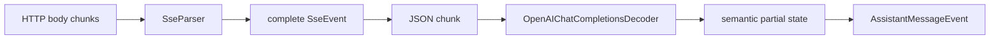

# Streaming Protocol Parsing：Transport Chunk、SSE 与 Partial JSON

> 建立版本：v0.0.2。  
> 主要代码：`src/ai/sse_parser.*`、`src/ai/streaming_json.*`、`src/ai/openai_completions_decoder.*`。

## 1. 最重要的三个边界

流式协议实现最容易犯的错误，是把下面三种“边界”当成同一回事：

```text
HTTP transport chunk boundary
SSE event boundary
JSON / semantic object boundary
```

实际上它们完全独立。

例如：

```text
transport chunk #1: data: {"cho
transport chunk #2: ices":[...]}

transport chunk #3: \n\ndata: {...}\n\n
```

第一条 SSE 跨了两个 transport chunk；第三个 transport chunk 又一次包含两条 SSE 的边界。

因此长期规则是：

> 每一层只处理自己负责的 framing，不能假设上一层 callback 恰好按下一层语义切块。

## 2. 三层流水线



### Layer 1：Transport

只保证按顺序提供 bytes/chunks，不保证：

- 一次 callback 是完整行；
- 一次 callback 是完整 SSE；
- UTF-8/JSON/SSE 恰好对齐；
- tool arguments 是完整 JSON。

### Layer 2：SSE framing

负责：

- 行结束；
- 空行 dispatch；
- `data:` 多行拼接；
- `event:`；
- `id:`；
- `retry:`；
- comment/heartbeat。

不负责 OpenAI JSON 语义。

### Layer 3：Protocol semantics

负责：

- JSON parse；
- delta 聚合；
- text/thinking/tool state；
- usage/finish reason；
- partial tool arguments。

## 3. SseParser 为什么必须有内部 buffer

`feed(chunk)` 的输入可以在任何位置结束：

```text
"data: hello\r"
```

下一次可能才收到：

```text
"\n\r\n"
```

如果第一轮看到 `\r` 就立即当成完整换行，会把跨 chunk 的 `\r\n` 错误拆开。

当前 parser 的做法：

```text
buffer append
   ↓
寻找 \r / \n
   ↓
如果 \r 位于当前 buffer 末尾且还没 finish
   → 暂停，等待下一 chunk
```

因此能正确处理：

```text
LF
CRLF
CRLF split across chunks
```

## 4. 空行才 dispatch SSE event

SSE 的一条 event 由多行组成，空行表示结束：

```text
event: message
id: 42
data: hello
data: world

```

parser 必须积累状态，直到空行：

```text
data = "hello\nworld"
event = "message"
id = "42"
```

不能遇到每个 `data:` 就直接触发 handler，否则多行 data 会被错误拆成多条事件。

## 5. `data:` 多行规则

每个 `data:` value 后临时追加换行：

```text
data: A
data: B
```

积累为：

```text
A\nB\n
```

dispatch 前去掉最后一个额外换行：

```text
A\nB
```

这是 SSE framing 语义，不应让 decoder 再自己猜如何合并多行 data。

## 6. comment、id 与 retry

### comment

以 `:` 开头的行是 comment/heartbeat，忽略：

```text
: ping
```

### id

`id:` 会更新 last event id；含 NUL 的 id 不接受。

### retry

SSE `retry:` 只接受数字毫秒，并检查整数溢出。

注意：SSE `retry:` 和 HTTP retry policy 是两个不同概念。当前 OpenAI Provider 的 HTTP retry 主要依据 HTTP status/header，不应因为字段都叫 retry 就把两者合并成一个状态机。

## 7. finish() 的意义

正常 streaming 过程中 parser 等待后续 chunk，因此一个没有行终止符的尾部字符串不能提前 dispatch。

当 transport 明确结束时调用：

```cpp
parser.finish();
```

此时剩余 buffer 可以作为最后一行处理。

这是：

```text
incremental feed
vs
end-of-input flush
```

的显式区分。

## 8. SSE event 完整，不代表 JSON 完整语义

OpenAI Chat Completions 的 SSE `data:` 通常是一个完整 JSON chunk，但 JSON 内部的字段本身仍可能是**语义上的 partial**。

典型 tool call：

```text
chunk 1 arguments = {"path":"READ
chunk 2 arguments = ME.md"}
```

每条外层 ChatCompletionChunk JSON 都合法，但：

```text
toolCall.function.arguments
```

是跨 chunk 拼接的字符串。

所以 decoder 需要维护：

```text
partialArgs += delta.arguments
```

然后不断尝试恢复当前 partial JSON。

## 9. Streaming JSON 为什么不能只做 `json::parse`

如果当前字符串是：

```json
{"path":"READ
```

严格 JSON parser 会失败，但上游 pi v0.80.0 会尽可能恢复当前已知语义，让 streaming event 的 `partial.arguments` 立即可观察。

因此 private `parseStreamingJson()` 采用：

```text
1. complete parse
2. malformed-string repair + parse
3. partial parse
4. unrecoverable → {}
```

它只用于 streaming protocol 内部，不应该变成通用 public JSON parser。

## 10. repairJson 的兼容目的

Provider 实际输出有时会包含：

- string 内原始 control character；
- 非法 backslash escape；
- streaming 中间态。

如果直接严格 parse，会比固定上游更早失败。

`repairJson()` 的目标是：

> 在与 pi v0.80.0 相同的兼容精神下修复 malformed string literal，再继续 partial parse。

它不是“接受任何垃圾 JSON”的通用容错层。

修复范围应该由 real fixture / focused test 驱动，不要无限放宽。

## 11. Semantic Decoder 必须持有状态

`OpenAIChatCompletionsDecoder` 不是纯：

```text
JSON in → event out
```

而是一个 streaming state machine：

```text
AssistantMessage output
text block state
thinking block state
tool states by index/id
pending reasoning details
finish_reason seen?
terminal?
```

这是因为每个 delta 的含义依赖前面的 delta。

例如 tool call：

```text
first delta   → index=0, partial args
second delta  → same index, id/name arrive late
third delta   → final args
```

单条 chunk 无法独立生成最终 `ToolCall`。

## 12. Start event 的 partial snapshot 是协议可观察语义

v0.0.2 real differential 实际发现：

```text
text_start.partial
```

以及：

```text
toolcall_start.partial.arguments
```

在 pi v0.80.0 中已经包含首轮 delta 的可观察内容。

这说明事件类型相同还不够；**事件发出的时点**本身也是兼容协议的一部分。

所以 decoder 改动时必须同时关注：

```text
event ordering
partial snapshot timing
final aggregation
```

## 13. 为什么 Parser 与 Decoder 必须分开测试

如果只做 end-to-end test：

```text
HTTP → Provider → events
```

失败时很难判断：

- transport split 错；
- SSE framing 错；
- JSON repair 错；
- tool state 错。

当前分层测试：

```text
test_sse_parser
  → framing

test_streaming_json
  → partial JSON

test_openai_completions_decoder
  → protocol state

test_openai_tool_streaming
  → tool partial semantics

Compatibility
  → public end-to-end observable behavior
```

这形成从低层到高层的故障定位梯度。

## 14. 新流式协议的实现模板

以后接入新的 streaming provider 时，优先按下面分层：

```text
HttpTransport
      ↓ bytes
FramingParser
      ↓ complete protocol frames
ProtocolDecoder
      ↓ semantic events
EventStream
```

如果协议不是 SSE，可以替换 framing parser，但不要把 transport callback 直接塞进 semantic decoder。

## 15. 测试 checklist

任何 framing parser 至少测试：

```text
1 byte per feed
multiple frames in one feed
frame split at every delimiter
CR/LF boundary
empty lines
final incomplete line + finish()
large field
invalid metadata
```

任何 streaming semantic decoder 至少测试：

```text
first delta
multiple deltas
partial state snapshots
late id/name
multiple logical blocks
terminal reason
malformed payload
transport end without protocol terminal
```

## 16. 设计结论

流式协议实现应牢记：

1. **transport chunk 只是 bytes，不是 message。**
2. **framing parser 只决定 frame 边界，不解释业务语义。**
3. **outer JSON 完整不代表 inner streaming field 完整。**
4. **partial state 和 event emission timing 都可能是 public observable behavior。**
5. **低层 parser test + 高层 differential test 缺一不可。**
